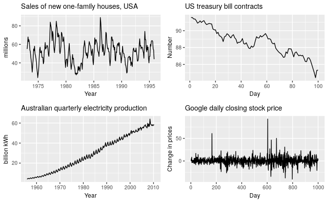
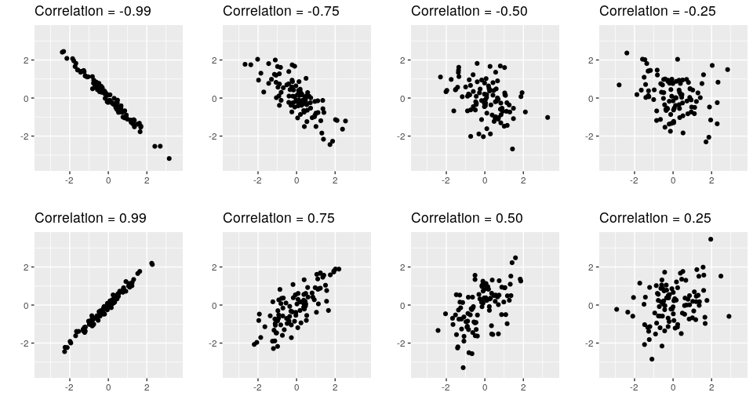
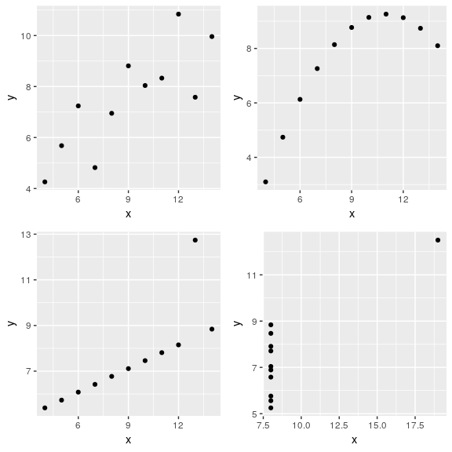
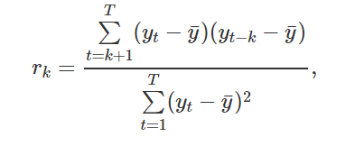
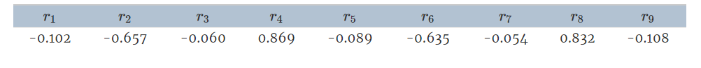

```{r setup, include = FALSE}
knitr::opts_chunk$set(include = TRUE, echo = TRUE)
library(forecast)
library(fpp2)
```

## Structure

**1. Defining a ```ts``` object**

**2. Time plots**

**3. Time series patterns**

*3.1 Trend:*

*3.2 Seasonal:*

*3.3 Cyclic:*

**4.Seasonal plots**

**5.Seasonal subseries plots**

**6. Scatterplots**

*6.1. Correlation*

*6.2. Scatterplot matrices*

**7. Lag plots**

**8. Autocorelation**

*8.1. Trend and seasonality in ACF plots*

**9. White noise**

**10. Some simple forecasting methods**

*10.1. Average method*

*10.2. Naive method*

*10.3. Seasonal naive method*

*10.4. Drift method*

*10.5. Examples*

**11. Transformations and adjustments**

*11.1 Calendar adjustments*

*11.2 Population adjustments*

*11.3 Population adjustments*

*11.4 Inflation adjustments*

*11.5 Mathematical transformations*

*11.6 Features of power transformations*

*11.7 Bias adjustments*

**12. Residual diagnostics**

*12.1 Fitted values*

*12.2 Residuals*

*12.3 Example: Forecasting the Google daily closing stock price*

*12.4 Portmanteau tests for autocorrelation*

**13. Evaluating forecast accuracy**

*13.1 Training and test sets*

*13.2 Functions to subset a time series*

*13.3 Forecast errors*

*13.4 Scale-dependent errors*

*13.5 Percentage errors*

*13.6 Examples*

*13.7 Time series cross-validation*

*13.8 Pipe operator*

*13.9 Example: using tsCV()*

*13.10 Bibliography*

**14. Prediction intervals**

*14.1 One-step prediction intervals*

*14.2 Multi-step prediction intervals*

*14.3 Benchmark methods*

*14.4 Prediction intervals from bootstrapped residuals*

*14.5 Prediction intervals with transformations*

**15. The forecast package in R**

*15.1 Functions that output a forecast object:*

*15.2 ```forecast()``` function*


## **1. Defining a ```ts``` object**

#### Time series can be thought as a list of numbers along with information about those numbers. To sotre this information in R we use the ```ts``` object with the help of the ```ts()``` function:

```{r}
y <- ts(c(123,39,78,52,110), start=2012)
y
# the start argument is the time of the first observation
z = c(123,39,78,52,110)
y <- ts(z, start=2003, frequency=12) # frequency is the number of observations per unit of time
y
```


## **2. Time plots** ##

#### Time plots are observations plotted againts the time of observation, with consecutive observations joined by straight lines

```{r}
autoplot(melsyd[,"Economy.Class"]) + # The Autoplot() command will automattically produces a plot of whatever is passed as its first argument.
  ggtitle("Economy class passengers: Melbourne-Sydney") + # ggtitle() command will set the title of the graph
  xlab("Year") + # xlab() and ylab() commands will set the labels of the graph
  ylab("Thousands")
```


#### A simpler time series is:

```{r}
autoplot(a10) +
  ggtitle("Antidiabetic drug sales") +
  ylab("$ million") +
  xlab("Year")
```

#### Here, there is a clear and increasing trend. There is also a strong seasonal pattern that increases in size as the level of the series increases. The sudden drop at the start of each year is caused by a government subsidisation scheme that makes it cost-effective for patients to stockpile drugs at the end of the calendar year. Any forecasts of this series would need to capture the seasonal pattern, and the fact that the trend is changing slowly.

## **3. Time series patterns** ##

### **3.1 Trend:**


#### A trend exists when there is a long-term increase or decrease in the data. It does not have to be linear. Sometimes we will refer to a trend as "changing direction" , when it might go from an increasing trend to a decreasing trend. There is a trend in the antidiabetic drug sales data shown in Figure 2.2.


### **3.2 Seasonal:**


#### A seasonal pattern occurs when a time series is affected by seasonal factors such as the time of the year or the day of the week. Seasonality is always of a fixed and known frequency. The monthly sales of antidiabetic drugs above shows seasonality which is induced partly by the change in the cost of the drugs at the end of the calendar year.


### **3.3 Cyclic:**


#### A cycle occurs when the data exhibit rises and falls that are not of a fixed frequency. These fluctuations are usually due to economic conditions, and are often related to the "business cycle". The duration of these fluctuations is usually at least 2 years.

<center>

</center>

#### 1. The monthly housing sales (top left) show strong seasonality within each year, as well as some strong cyclic behaviour with a period of about 6-10 years. There is no apparent trend in the data over this period.

#### 2. The US treasury bill contracts (top right) show results from the Chicago market for 100 consecutive trading days in 1981. Here there is no seasonality, but an obvious downward trend. Possibly, if we had a much longer series, we would see that this downward trend is actually part of a long cycle, but when viewed over only 100 days it appears to be a trend.

#### 3. The Australian quarterly electricity production (bottom left) shows a strong increasing trend, with strong seasonality. There is no evidence of any cyclic behaviour here.

#### 4. The daily change in the Google closing stock price (bottom right) has no trend, seasonality or cyclic behaviour. There are random fluctuations which do not appear to be very predictable, and no strong patterns that would help with developing a forecasting model.


## **4.Seasonal plots:**

#### A seasonal plot is similar to a time plot except that the data are plotted against the individual “seasons” in which the data were observed.

``` {r}
ggseasonplot(a10, year.labels=TRUE, year.labels.left=TRUE) +
  ylab("$ million") +
  ggtitle("Seasonal plot: antidiabetic drug sales")
```

#### These are exactly the same data as were shown earlier, but now the data from each season are overlapped. A seasonal plot allows the underlying seasonal pattern to be seen more clearly, and is especially useful in identifying years in which the pattern changes.

#### A useful variation on the seasonal plot uses polar coordinates. Setting polar=TRUE makes the time series axis circular rather than horizontal, as shown below.


``` {r}
ggseasonplot(a10, polar=TRUE) +
  ylab("$ million") +
  ggtitle("Polar seasonal plot: antidiabetic drug sales")
```


## **5.Seasonal subseries plots**


#### An alternative plot that emphasises the seasonal patterns is where the data for each season are collected together in separate mini time plots.

```{r}
ggsubseriesplot(a10) +
  ylab("$ million") +
  ggtitle("Seasonal subseries plot: antidiabetic drug sales")
```


#### The horizontal lines indicate the means for each month. This form of plot enables the underlying seasonal pattern to be seen clearly, and also shows the changes in seasonality over time. It is especially useful in identifying changes within particular seasons. In this example, the plot is not particularly revealing; but in some cases, this is the most useful way of viewing seasonal changes over time.


## 6. Scatterplots


#### The graphs discussed so far are useful for visualising individual time series. It is also useful to explore relationships between time series. The next figure shows  two time series: half-hourly electricity demand (in Gigawatts) and temperature (in degrees Celsius), for 2014 in Victoria, Australia. The temperatures are for Melbourne, the largest city in Victoria, while the demand values are for the entire state.


```{r}
autoplot(elecdemand[,c("Demand","Temperature")], facets=TRUE) +
  xlab("Year: 2014") + ylab("") +
  ggtitle("Half-hourly electricity demand: Victoria, Australia")
```


#### We can study the relationship between demand and temperature by plotting one series against the other.


```{r}
qplot(Temperature, Demand, data=as.data.frame(elecdemand)) +
  ylab("Demand (GW)") + xlab("Temperature (Celsius)")
```


### **6.1. Correlation**


#### It is common to compute correlation coefficients to measure the strength of the relationship between two variables. The correlation between variables **x** and **y** is given by:


<center>
$r = \frac{\sum (x_{t} - \bar{x})(y_{t}-\bar{y})}{\sqrt{\sum(x_{t}-\bar{x})^2}\sqrt{\sum(y_{t}-\bar{y})^2}}.$
<center>


#### The value of **r** always lies between **−1** and **1** with negative values indicating a negative relationship and positive values indicating a positive relationship. The following graphs show examples of data sets with varying levels of correlation.


<center>

<center>


<center>

<center>


#### The plots in the last figure all have correlation coefficients of 0.82, but they have very different relationships. This shows how important it is to look at the plots of the data and not simply rely on correlation values.


### **6.2. Scatterplot matrices**


#### When there are several potential predictor variables, it is useful to plot each variable against each other variable, as in showing quarterly visitor numbers for five regions of New South Wales, Australia.


```{r}
autoplot(visnights[,1:5], facets=TRUE) +
  ylab("Number of visitor nights each quarter (millions)")
```


#### To see the relationships between these five time series, we can plot each time series against the others. These plots can be arranged in a scatterplot matrix:


```{r}
GGally::ggpairs(as.data.frame(visnights[,1:5]))
```


#### For each panel, the variable on the vertical axis is given by the variable name in that row, and the variable on the horizontal axis is given by the variable name in that column. There are many options available to produce different plots within each panel. In the default version, the correlations are shown in the upper right half of the plot, while the scatterplots are shown in the lower half. On the diagonal are shown density plots.

#### The value of the scatterplot matrix is that it enables a quick view of the relationships between all pairs of variables. In this example, the second column of plots shows there is a strong positive relationship between visitors to the NSW north coast and visitors to the NSW south coast, but no detectable relationship between visitors to the NSW north coast and visitors to the NSW south inland.


## **7. Lag plots **


#### The next figure displays scatterplots of quarterly Australian beer production, where the horizontal axis shows lagged values of the time series. Each graph shows **yt** plotted against **yt-k** for different values of k.

```{r}
beer2 <- window(ausbeer, start=1992)
gglagplot(beer2)
```


#### Here the colours indicate the quarter of the variable on the vertical axis. The lines connect points in chronological order. The relationship is strongly positive at lags 4 and 8, reflecting the strong seasonality in the data. The negative relationship seen for lags 2 and 6 occurs because peaks (in Q4) are plotted against troughs (in Q2).

#### The window() function used here is very useful when extracting a portion of a time series. In this case, we have extracted the data from **ausbeer**, beginning in 1992.


## **8. Autocorelation **


#### Autocorrelation measures the linear relationship between lagged values of a time series. The value of rk can be written as:


<center>

<center>


#### The first nine autocorrelation coefficients for the beer production data are given in the following table.


<center>

<center>


#### These correspond to the nine scatterplots, also known as a correlogram.

```{r}
ggAcf(beer2)
```


#### **r4** is higher than for the other lags. This is due to the seasonal pattern in the data: the peaks tend to be four quarters apart and the troughs tend to be four quarters apart.
#### **r2** is more negative than for the other lags because troughs tend to be two quarters behind peaks.
#### The dashed blue lines indicate whether the correlations are significantly different from zero.


## **8.1 .Trend and seasonality in ACF plots**


#### When data have a trend, the autocorrelations for small lags tend to be large and positive because observations nearby in time are also nearby in size. So the ACF of trended time series tend to have positive values that slowly decrease as the lags increase.
#### When data are seasonal, the autocorrelations will be larger for the seasonal lags (at multiples of the seasonal frequency) than for other lags.
#### When data are both trended and seasonal, you see a combination of these effects. The monthly Australian electricity demand series plotted next shows both trend and seasonality


```{r}
aelec <- window(elec, start=1980)
autoplot(aelec) + xlab("Year") + ylab("GWh")
```

#### Its ACF is shown as:

```{r}
ggAcf(aelec, lag=48)
```


#### The slow decrease in the ACF as the lags increase is due to the trend, while the “scalloped” shape is due the seasonality.

## **9. White noise **


#### Time series that show no autocorrelation are called white noise. The next figure illustrates an example of white noise.


```{r}
set.seed(30)
y <- ts(rnorm(50))
autoplot(y) + ggtitle("White noise")
```


#### For white noise series, we expect each autocorrelation to be close to zero. Of course, they will not be exactly equal to zero as there is some random variation. For a white noise series, we expect 95% of the spikes in the ACF to lie within ±2/√T where T is the length of the time series.
 
#### In this example, T=50 and so the bounds are at ±2/√50=±0.28.All of the autocorrelation coefficients lie within these limits, confirming that the data are white noise.


```{r}
ggAcf(y)
```


## **Exercices **

### 1. Use the help function to explore what the series gold, woolyrnq and gas represent.

```{r}
help(gold)
help(woolyrnq)
help(gas)
```


#### a. Use autoplot() to plot each of these in separate plots.


```{r}
autoplot(gold)
autoplot(woolyrnq)
autoplot(gas)
```


#### What is the frequency of each series? Hint: apply the frequency() function.


```{r}
print("Frequency")
print("gold")
frequency(gold)
print("woolyrnq")
frequency(woolyrnq)
print("gas")
frequency(gas)
```


#### Use which.max() to spot the outlier in the gold series. Which observation was it?


```{r}
print("When gold got maximum value?")
which.max(gold)
print("What was the gold's maximum value?")
gold[which.max(gold)]
```


#### 2. Download the file tute1.csv from the book website, open it in Excel (or some other spreadsheet application), and review its contents. You should find four columns of information. Columns B through D each contain a quarterly series, labelled Sales, AdBudget and GDP. Sales contains the quarterly sales for a small company over the period 1981-2005. AdBudget is the advertising budget and GDP is the gross domestic product. All series have been adjusted for inflation.


#### a. You can read the data into R with the following script:


```{r}
tute1 <- read.csv("./tute1.csv", header=TRUE)
View(tute1)
```


#### b. Convert the data to time series


```{r}
mytimeseries <- ts(tute1[,-1], start=1981, frequency=4)
```


#### c. Construct time series plots of each of the three series


```{r}
autoplot(mytimeseries, facets=TRUE)
autoplot(mytimeseries)
```


#### 5. Use the ggseasonplot() and ggsubseriesplot() functions to explore the seasonal patterns in the following time series: writing, fancy, a10, h02.
#### a) What can you say about the seasonal patterns?
#### b) Can you identify any unusual years?

```{r}
ggseasonplot(writing)
ggsubseriesplot(writing)
# The sales amount of paper falls down in August annually
```

```{r}
ggseasonplot(fancy)
ggsubseriesplot(fancy)
# In December, 1992 the monthly sales for a souvenir shop increased dramatically compared to the same month of the last year
```

```{r}
ggseasonplot(a10)
ggsubseriesplot(a10)
# The amount of antidiabetes monthly scripts falls down in February annually
```

```{r}
ggseasonplot(h02)
ggsubseriesplot(h02)
# The amount of corticosteroid monthly scripts also falls down in February annually
```