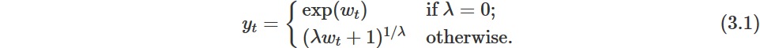
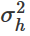

 
```{r setup, include = TRUE}
knitr::opts_chunk$set(include = TRUE, echo = TRUE)
library(forecast)
library(fpp2)
```

## 10. Some simple forecasting methods

#### Some forecasting methods are extremely simple and surprisingly effective. We will use the following four forecasting methods as benchmarks throughout this book.

### **10.1. Average method**

#### Here, the forecasts of all future values are equal to the average (or “mean”) of the historical data. If we let the historical data be denoted by y1,…,yT, then we can write the forecasts as 

<center>

</center>

#### The notation  is a short-hand for the estimate of  based on the data .

```{r}
y <- ts(c(123,39,78,52,110), start=2012) # y contains the time series
h = 10 # h is the forecast horizon
meanf(y, h)
```
### **10.2. Naïve method**

#### For naïve forecasts, we simply set all forecasts to be the value of the last observation. That is, 
<center>

</center>

#### This method works remarkably well for many economic and financial time series.

```{r}
y <- ts(c(123,39,78,52,110), start=2012) # y contains the time series
h = 10 # h is the forecast horizon
naive(y, h)
rwf(y, h) # Equivalent alternative
```

### **10.3. Seasonal naïve method**

####  similar method is useful for highly seasona l data. In this case, we set each forecast to be equal to the last observed value from the same season of the year (e.g., the same month of the previous year). Formally, the forecast for time T+h is written as

<center>

</center>

#### where m= the seasonal period, and k is the integer part of (h−1)/m (i.e., the number of complete years in the forecast period prior to time T+h). This looks more complicated than it really is. For example, with monthly data, the forecast for all future February values is equal to the last observed February value. With quarterly data, the forecast of all future Q2 values is equal to the last observed Q2 value (where Q2 means the second quarter). Similar rules apply for other months and quarters, and for other seasonal periods.

```{r}
y <- ts(c(123,39,78,52,110), start=2012) # y contains the time series
h = 10 # h is the forecast horizon
snaive(y, h)
```

### **10.3. Seasonal naïve method**

#### A variation on the naïve method is to allow the forecasts to increase or decrease over time, where the amount of change over time (called the **drift**) is set to be the average change seen in the historical data. Thus the forecast for time T+h is given by 

<center>

</center>

#### This is equivalent to drawing a line between the first and last observations, and extrapolating it into the future.

```{r}
y <- ts(c(123,39,78,52,110), start=2012) # y contains the time series
h = 10 # h is the forecast horizon
rwf(y, h, drift=TRUE)
```

### **10.4. Examples**

#### The Figure bellow shows the first three methods applied to the quarterly beer production data.

```{r}
# Set training data from 1992 to 2007
beer2 <- window(ausbeer,start=1992,end=c(2007,4))
# Plot some forecasts
autoplot(beer2) +
  autolayer(meanf(beer2, h=11),
    series="Mean", PI=FALSE) +
  autolayer(naive(beer2, h=11),
    series="Naïve", PI=FALSE) +
  autolayer(snaive(beer2, h=11),
    series="Seasonal naïve", PI=FALSE) +
  ggtitle("Forecasts for quarterly beer production") +
  xlab("Year") + ylab("Megalitres") +
  guides(colour=guide_legend(title="Forecast"))
```

#### The Figure bellow, the non-seasonal methods are applied to a series of 200 days of the Google daily closing stock price.

```{r}
autoplot(goog200) +
  autolayer(meanf(goog200, h=40),
    series="Mean", PI=FALSE) +
  autolayer(rwf(goog200, h=40),
    series="Naïve", PI=FALSE) +
  autolayer(rwf(goog200, drift=TRUE, h=40),
    series="Drift", PI=FALSE) +
  ggtitle("Google stock (daily ending 6 Dec 2013)") +
  xlab("Day") + ylab("Closing Price (US$)") +
  guides(colour=guide_legend(title="Forecast"))
```

#### Sometimes one of these simple methods will be the best forecasting method available; but in many cases, these methods will serve as benchmarks rather than the method of choice. That is, any forecasting methods we develop will be compared to these simple methods to ensure that the new method is better than these simple alternatives. If not, the new method is not worth considering.

## 11. Transformations and adjustments

### **11.1 Calendar adjustments**

### Some of the variation seen in seasonal data may be due to simple calendar effects. In such cases, it is usually much easier to remove the variation before fitting a forecasting model. The ```monthdays()``` function will compute the number of days in each month or quarter.

###For example, if you are studying the monthly milk production on a farm, there will be variation between the months simply because of the different numbers of days in each month, in addition to the seasonal variation across the year.

```{r}
dframe <- cbind(Monthly = milk,
                DailyAverage = milk/monthdays(milk))
  autoplot(dframe, facet=TRUE) +
    xlab("Years") + ylab("Pounds") +
    ggtitle("Milk production per cow")
```

### **11.2 Population adjustments**

#### Any data that are affected by population changes can be adjusted to give per-capita data. That is, consider the data per person (or per thousand people, or per million people) rather than the total. For example, if you are studying the number of hospital beds in a particular region over time, the results are much easier to interpret if you remove the effects of population changes by considering the number of beds per thousand people. Then you can see whether there have been real increases in the number of beds, or whether the increases are due entirely to population increases. It is possible for the total number of beds to increase, but the number of beds per thousand people to decrease. This occurs when the population is increasing faster than the number of hospital beds. For most data that are affected by population changes, it is best to use per-capita data rather than the totals.

### **11.3 Population adjustments**

#### Data which are affected by the value of money are best adjusted before modelling. For example, the average cost of a new house will have increased over the last few decades due to inflation. A $200,000 house this year is not the same as a $200,000 house twenty years ago. For this reason, financial time series are usually adjusted so that all values are stated in dollar values from a particular year. For example, the house price data may be stated in year 2000 dollars.

#### To make these adjustments, a price index is used. If  denotes the price index and  denotes the original house price in year t, then  gives the adjusted house price at year 2000 dollar values. Price indexes are often constructed by government agencies. For consumer goods, a common price index is the Consumer Price Index (or CPI).

### **11.4 Mathematical transformations**

#### If the data show variation that increases or decreases with the level of the series, then a transformation can be useful. For example, a logarithmic transformation is often useful. If we denote the original observations as  and the transformed observations as , then . Logarithms are useful because they are interpretable: changes in a log value are relative (or percentage) changes on the original scale. So if log base 10 is used, then an increase of 1 on the log scale corresponds to a multiplication of 10 on the original scale. Another useful feature of log transformations is that they constrain the forecasts to stay positive on the original scale.

#### Sometimes other transformations are also used (although they are not so interpretable). For example, square roots and cube roots can be used. These are called **power transformations** because they can be written in the form 

#### A useful family of transformations, that includes both logarithms and power transformations, is the family of Box-Cox transformations, which depend on the parameter λ and are defined as follows: 

<center>

</center>

#### The logarithm in a Box-Cox transformation is always a natural logarithm (i.e., to base e). So if λ=0, natural logarithms are used, but if λ≠0, a power transformation is used, followed by some simple scaling.

#### If λ=1, then , so the transformed data is shifted downwards but there is no change in the shape of the time series. But for all other values of λ, the time series will change shape.

#### Use the slider below to see the effect of varying λ to transform Australian monthly electricity demand:

```{r}
(lambda <- BoxCox.lambda(elec))
autoplot(BoxCox(elec,lambda))
```

#### A good value of λ is one which makes the size of the seasonal variation about the same across the whole series, as that makes the forecasting model simpler. In this case, λ=0.30 works quite well, although any value of λ between 0 and 0.5 would give similar results.

#### The ```BoxCox.lambda()``` function will choose a value of lambda for you.

```{r}
(lambda <- BoxCox.lambda(elec))
#> [1] 0.2654
autoplot(BoxCox(elec,lambda))
```

#### Having chosen a transformation, we need to forecast the transformed data. Then, we need to reverse the transformation (or back-transform) to obtain forecasts on the original scale. The reverse Box-Cox transformation is given by 

<center>

</center>

### **11.5 Features of power transformations**

* #### If some , no power transformation is possible unless all observations are adjusted by adding a constant to all values.
* #### Choose a simple value of λ. It makes explanations easier.
* #### The forecasting results are relatively insensitive to the value of λ.
* #### Often no transformation is needed.
* #### Transformations sometimes make little difference to the forecasts but have a large effect on prediction intervals.

### **11.5 Bias adjustments**

#### One issue with using mathematical transformations such as Box-Cox transformations is that the back-transformed point forecast will not be the mean of the forecast distribution. In fact, it will usually be the median of the forecast distribution (assuming that the distribution on the transformed space is symmetric). For many purposes, this is acceptable, but occasionally the mean forecast is required. For example, you may wish to add up sales forecasts from various regions to form a forecast for the whole country. But medians do not add up, whereas means do.

#### For a Box-Cox transformation, the back-transformed mean is given by 

<center>

</center>

#### where  is the ***h***-step forecast variance. The larger the forecast variance, the bigger the difference between the mean and the median.

#### The difference between the simple back-transformed forecast given by (3.1) and the mean given by (3.2) is called the **bias**. When we use the mean, rather than the median, we say the point forecasts have been **bias-adjusted**.

#### To see how much difference this bias-adjustment makes, consider the following example, where we forecast average annual price of eggs using the drift method with a log transformation (λ=0). The log transformation is useful in this case to ensure the forecasts and the prediction intervals stay positive.

```{r}
fc <- rwf(eggs, drift=TRUE, lambda=0, h=50, level=80)
fc2 <- rwf(eggs, drift=TRUE, lambda=0, h=50, level=80,
  biasadj=TRUE)
autoplot(eggs) +
  autolayer(fc, series="Simple back transformation") +
  autolayer(fc2, series="Bias adjusted", PI=FALSE) +
  guides(colour=guide_legend(title="Forecast"))
```

#### The blue line in Figure 3.4 shows the forecast medians while the red line shows the forecast means. Notice how the skewed forecast distribution pulls up the point forecast when we use the bias adjustment.

#### Bias adjustment is not done by default in the **forecast** package. If you want your forecasts to be means rather than medians, use the argument ```biasadj=TRUE``` when you select your Box-Cox transformation parameter.

## 12. Residual diagnostics

### 12.1 Fitted values

#### Each observation in a time series can be forecast using all previous observations. We call these **fitted values** and they are denoted by  

