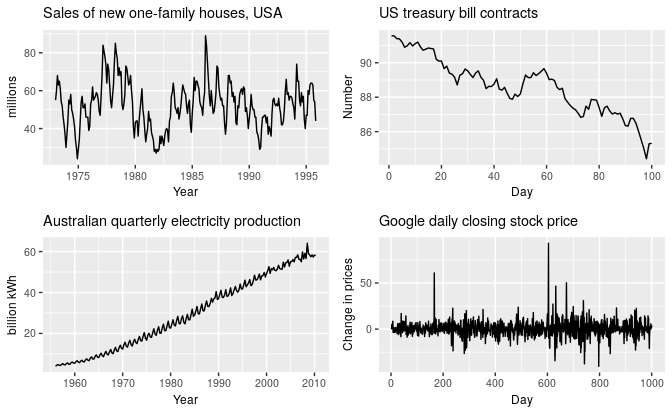
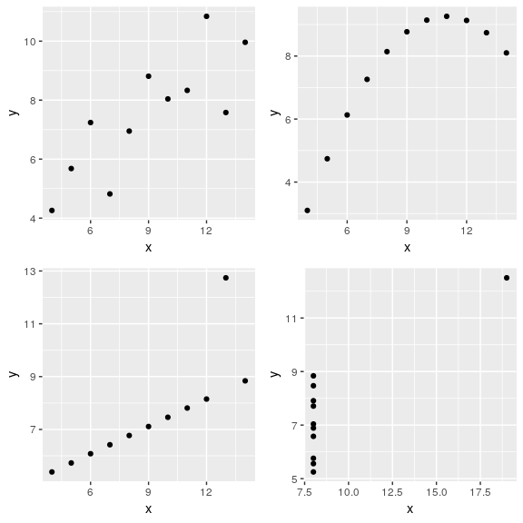

```{r setup, include = FALSE}
knitr::opts_chunk$set(include = TRUE, echo = TRUE)
library(forecast)
library(fpp2)
```

## Structure

**1. Defining a ```ts``` object**

**2. Time plots**

**3. Time series patterns**

*3.1 Trend:*

*3.2 Seasonal:*

*3.3 Cyclic:*

**4.Seasonal plots**

**5.Seasonal subseries plots**

**6. Scatterplots**

*6.1. Correlation*

*6.2. Scatterplot matrices*

**7. Lag plots**

**8. Autocorelation**

*8.1. Trend and seasonality in ACF plots*

**9. White noise**

**10. Some simple forecasting methods**

*10.1. Average method*

*10.2. Naive method*

*10.3. Seasonal naive method*

*10.4. Drift method*

*10.5. Examples*

**11. Transformations and adjustments**

*11.1 Calendar adjustments*

*11.2 Population adjustments*

*11.3 Inflation adjustments*

*11.4 Mathematical transformations*

**12. Residual diagnostics**

*12.1 Fitted values*

*12.2 Residuals*

*12.3 Example: Forecasting the Google daily closing stock price*

**13. Evaluating forecast accuracy**

*13.1 Pipe operator*

*13.2 Example: using tsCV()*

**14. Prediction intervals**

*14.1 Benchmark methods*

*14.2  Prediction intervals from bootstrapped residuals*

*14.5 Prediction intervals with transformations*

**15. The forecast package in R**

*15.1 Functions that output a forecast object:*

*15.2 ```forecast()``` function*

## **1. Defining a ```ts``` object**

#### Time series can be thought as a list of numbers along with information about those numbers. To sotre this information in R we use the ```ts``` object with the help of the ```ts()``` function:

```{r}
y <- ts(c(123,39,78,52,110), start=2012)
y
# the start argument is the time of the first observation
z = c(123,39,78,52,110)
y <- ts(z, start=2003, frequency=12) # frequency is the number of observations per unit of time
y
```


## **2. Time plots** ##

#### Time plots are observations plotted againts the time of observation, with consecutive observations joined by straight lines

```{r}
autoplot(melsyd[,"Economy.Class"]) + # The Autoplot() command will automattically produces a plot of whatever is passed as its first argument.
  ggtitle("Economy class passengers: Melbourne-Sydney") + # ggtitle() command will set the title of the graph
  xlab("Year") + # xlab() and ylab() commands will set the labels of the graph
  ylab("Thousands")
```


#### A simpler time series is:

```{r}
autoplot(a10) +
  ggtitle("Antidiabetic drug sales") +
  ylab("$ million") +
  xlab("Year")
```

#### Here, there is a clear and increasing trend. There is also a strong seasonal pattern that increases in size as the level of the series increases. The sudden drop at the start of each year is caused by a government subsidisation scheme that makes it cost-effective for patients to stockpile drugs at the end of the calendar year. Any forecasts of this series would need to capture the seasonal pattern, and the fact that the trend is changing slowly.

## **3. Time series patterns** ##

### **3.1 Trend:**


#### A trend exists when there is a long-term increase or decrease in the data. It does not have to be linear. Sometimes we will refer to a trend as "changing direction" , when it might go from an increasing trend to a decreasing trend. There is a trend in the antidiabetic drug sales data shown in Figure 2.2.


### **3.2 Seasonal:**


#### A seasonal pattern occurs when a time series is affected by seasonal factors such as the time of the year or the day of the week. Seasonality is always of a fixed and known frequency. The monthly sales of antidiabetic drugs above shows seasonality which is induced partly by the change in the cost of the drugs at the end of the calendar year.


### **3.3 Cyclic:**


#### A cycle occurs when the data exhibit rises and falls that are not of a fixed frequency. These fluctuations are usually due to economic conditions, and are often related to the "business cycle". The duration of these fluctuations is usually at least 2 years.

<center>

</center>

#### 1. The monthly housing sales (top left) show strong seasonality within each year, as well as some strong cyclic behaviour with a period of about 6-10 years. There is no apparent trend in the data over this period.

#### 2. The US treasury bill contracts (top right) show results from the Chicago market for 100 consecutive trading days in 1981. Here there is no seasonality, but an obvious downward trend. Possibly, if we had a much longer series, we would see that this downward trend is actually part of a long cycle, but when viewed over only 100 days it appears to be a trend.

#### 3. The Australian quarterly electricity production (bottom left) shows a strong increasing trend, with strong seasonality. There is no evidence of any cyclic behaviour here.

#### 4. The daily change in the Google closing stock price (bottom right) has no trend, seasonality or cyclic behaviour. There are random fluctuations which do not appear to be very predictable, and no strong patterns that would help with developing a forecasting model.


## **4.Seasonal plots:**

#### A seasonal plot is similar to a time plot except that the data are plotted against the individual “seasons” in which the data were observed.

``` {r}
ggseasonplot(a10, year.labels=TRUE, year.labels.left=TRUE) +
  ylab("$ million") +
  ggtitle("Seasonal plot: antidiabetic drug sales")
```

#### These are exactly the same data as were shown earlier, but now the data from each season are overlapped. A seasonal plot allows the underlying seasonal pattern to be seen more clearly, and is especially useful in identifying years in which the pattern changes.

#### A useful variation on the seasonal plot uses polar coordinates. Setting polar=TRUE makes the time series axis circular rather than horizontal, as shown below.


``` {r}
ggseasonplot(a10, polar=TRUE) +
  ylab("$ million") +
  ggtitle("Polar seasonal plot: antidiabetic drug sales")
```


## **5.Seasonal subseries plots**


#### An alternative plot that emphasises the seasonal patterns is where the data for each season are collected together in separate mini time plots.

```{r}
ggsubseriesplot(a10) +
  ylab("$ million") +
  ggtitle("Seasonal subseries plot: antidiabetic drug sales")
```


#### The horizontal lines indicate the means for each month. This form of plot enables the underlying seasonal pattern to be seen clearly, and also shows the changes in seasonality over time. It is especially useful in identifying changes within particular seasons. In this example, the plot is not particularly revealing; but in some cases, this is the most useful way of viewing seasonal changes over time.


## 6. Scatterplots


#### The graphs discussed so far are useful for visualising individual time series. It is also useful to explore relationships between time series. The next figure shows  two time series: half-hourly electricity demand (in Gigawatts) and temperature (in degrees Celsius), for 2014 in Victoria, Australia. The temperatures are for Melbourne, the largest city in Victoria, while the demand values are for the entire state.


```{r}
autoplot(elecdemand[,c("Demand","Temperature")], facets=TRUE) +
  xlab("Year: 2014") + ylab("") +
  ggtitle("Half-hourly electricity demand: Victoria, Australia")
```


#### We can study the relationship between demand and temperature by plotting one series against the other.


```{r}
qplot(Temperature, Demand, data=as.data.frame(elecdemand)) +
  ylab("Demand (GW)") + xlab("Temperature (Celsius)")
```


### **6.1. Correlation**


#### It is common to compute correlation coefficients to measure the strength of the relationship between two variables. The correlation between variables **x** and **y** is given by:


<center>
$r = \frac{\sum (x_{t} - \bar{x})(y_{t}-\bar{y})}{\sqrt{\sum(x_{t}-\bar{x})^2}\sqrt{\sum(y_{t}-\bar{y})^2}}.$
<center>


#### The value of **r** always lies between **−1** and **1** with negative values indicating a negative relationship and positive values indicating a positive relationship. The following graphs show examples of data sets with varying levels of correlation.


<center>

<center>


<center>

<center>


#### The plots in the last figure all have correlation coefficients of 0.82, but they have very different relationships. This shows how important it is to look at the plots of the data and not simply rely on correlation values.


### **6.2. Scatterplot matrices**


#### When there are several potential predictor variables, it is useful to plot each variable against each other variable, as in showing quarterly visitor numbers for five regions of New South Wales, Australia.


```{r}
autoplot(visnights[,1:5], facets=TRUE) +
  ylab("Number of visitor nights each quarter (millions)")
```


#### To see the relationships between these five time series, we can plot each time series against the others. These plots can be arranged in a scatterplot matrix:


```{r}
GGally::ggpairs(as.data.frame(visnights[,1:5]))
```


#### For each panel, the variable on the vertical axis is given by the variable name in that row, and the variable on the horizontal axis is given by the variable name in that column. There are many options available to produce different plots within each panel. In the default version, the correlations are shown in the upper right half of the plot, while the scatterplots are shown in the lower half. On the diagonal are shown density plots.

#### The value of the scatterplot matrix is that it enables a quick view of the relationships between all pairs of variables. In this example, the second column of plots shows there is a strong positive relationship between visitors to the NSW north coast and visitors to the NSW south coast, but no detectable relationship between visitors to the NSW north coast and visitors to the NSW south inland.


## **7. Lag plots **


#### The next figure displays scatterplots of quarterly Australian beer production, where the horizontal axis shows lagged values of the time series. Each graph shows **yt** plotted against **yt-k** for different values of k.

```{r}
beer2 <- window(ausbeer, start=1992)
gglagplot(beer2)
```


#### Here the colours indicate the quarter of the variable on the vertical axis. The lines connect points in chronological order. The relationship is strongly positive at lags 4 and 8, reflecting the strong seasonality in the data. The negative relationship seen for lags 2 and 6 occurs because peaks (in Q4) are plotted against troughs (in Q2).

#### The window() function used here is very useful when extracting a portion of a time series. In this case, we have extracted the data from **ausbeer**, beginning in 1992.


## **8. Autocorelation **


#### Autocorrelation measures the linear relationship between lagged values of a time series. The value of $r_{k}$ can be written as:


<center>

<center>


#### The first nine autocorrelation coefficients for the beer production data are given in the following table.


<center>

<center>


#### These correspond to the nine scatterplots, also known as a correlogram.

```{r}
ggAcf(beer2)
```


#### **r4** is higher than for the other lags. This is due to the seasonal pattern in the data: the peaks tend to be four quarters apart and the troughs tend to be four quarters apart.
#### **r2** is more negative than for the other lags because troughs tend to be two quarters behind peaks.
#### The dashed blue lines indicate whether the correlations are significantly different from zero.


## **8.1 .Trend and seasonality in ACF plots**


#### When data have a trend, the autocorrelations for small lags tend to be large and positive because observations nearby in time are also nearby in size. So the ACF of trended time series tend to have positive values that slowly decrease as the lags increase.
#### When data are seasonal, the autocorrelations will be larger for the seasonal lags (at multiples of the seasonal frequency) than for other lags.
#### When data are both trended and seasonal, you see a combination of these effects. The monthly Australian electricity demand series plotted next shows both trend and seasonality


```{r}
aelec <- window(elec, start=1980)
autoplot(aelec) + xlab("Year") + ylab("GWh")
```

#### Its ACF is shown as:

```{r}
ggAcf(aelec, lag=48)
```


#### The slow decrease in the ACF as the lags increase is due to the trend, while the “scalloped” shape is due the seasonality.

## **9. White noise **


#### Time series that show no autocorrelation are called white noise. The next figure illustrates an example of white noise.


```{r}
set.seed(30)
y <- ts(rnorm(50))
autoplot(y) + ggtitle("White noise")
```


#### For white noise series, we expect each autocorrelation to be close to zero. Of course, they will not be exactly equal to zero as there is some random variation. For a white noise series, we expect 95% of the spikes in the ACF to lie within  $\pm 2/\sqrt{T}$ where T is the length of the time series.
 
#### In this example, T=50 and so the bounds are at  $\pm 2/\sqrt{50}$ = $\pm 0.28$. All of the autocorrelation coefficients lie within these limits, confirming that the data are white noise.


```{r}
ggAcf(y)
```


## **Exercices **

### 1. Use the help function to explore what the series gold, woolyrnq and gas represent.

```{r}
help(gold)
help(woolyrnq)
help(gas)
```


#### a. Use autoplot() to plot each of these in separate plots.


```{r}
autoplot(gold)
autoplot(woolyrnq)
autoplot(gas)
```


#### What is the frequency of each series? Hint: apply the frequency() function.


```{r}
print("Frequency")
print("gold")
frequency(gold)
print("woolyrnq")
frequency(woolyrnq)
print("gas")
frequency(gas)
```


#### Use which.max() to spot the outlier in the gold series. Which observation was it?


```{r}
print("When gold got maximum value?")
which.max(gold)
print("What was the gold's maximum value?")
gold[which.max(gold)]
```


#### 2. Download the file tute1.csv from the book website, open it in Excel (or some other spreadsheet application), and review its contents. You should find four columns of information. Columns B through D each contain a quarterly series, labelled Sales, AdBudget and GDP. Sales contains the quarterly sales for a small company over the period 1981-2005. AdBudget is the advertising budget and GDP is the gross domestic product. All series have been adjusted for inflation.


#### a. You can read the data into R with the following script:


```{r}
tute1 <- read.csv("./tute1.csv", header=TRUE)
View(tute1)
```


#### b. Convert the data to time series


```{r}
mytimeseries <- ts(tute1[,-1], start=1981, frequency=4)
```


#### c. Construct time series plots of each of the three series


```{r}
autoplot(mytimeseries, facets=TRUE)
autoplot(mytimeseries)
```


#### 5. Use the ggseasonplot() and ggsubseriesplot() functions to explore the seasonal patterns in the following time series: writing, fancy, a10, h02.
#### a) What can you say about the seasonal patterns?
#### b) Can you identify any unusual years?

```{r}
ggseasonplot(writing)
ggsubseriesplot(writing)
# The sales amount of paper falls down in August annually
```

```{r}
ggseasonplot(fancy)
ggsubseriesplot(fancy)
# In December, 1992 the monthly sales for a souvenir shop increased dramatically compared to the same month of the last year
```

```{r}
ggseasonplot(a10)
ggsubseriesplot(a10)
# The amount of antidiabetes monthly scripts falls down in February annually
```

```{r}
ggseasonplot(h02)
ggsubseriesplot(h02)
# The amount of corticosteroid monthly scripts also falls down in February annually
```

## 10. Some simple forecasting methods

#### Some forecasting methods are extremely simple and surprisingly effective.

1. **Average method**
2. **Naïve method**
3. **Seasonal naïve method**
4. **Drift method**

## **10.1. Average method**

#### Here, the forecasts of all future values are equal to the average (or "mean") of the historical data. If we let the historical data be denoted by $y_{1},\dots,y_{T}$, then we can write the forecasts as 

<center>
$\hat{y}_{T+h|T} = \bar{y} = (y_{1}+\dots+y_{T})/T.$
</center>

#### The notation $\hat{y}_{T+h|T}$ is a short-hand for the estimate of $y_{T+h}$ based on the data $y_1,\dots,y_T$.

```{r}
y <- ts(c(123,39,78,52,110), start=2012) # y contains the time series
h = 10 # h is the forecast horizon
meanf(y, h)
```

## **10.2. Naïve method**

#### For naïve forecasts, we simply set all forecasts to be the value of the last observation. That is, 
<center>
$\hat{y}_{T+h|T} = y_{T}.$
</center>

#### This method works remarkably well for many economic and financial time series.

```{r}
y <- ts(c(123,39,78,52,110), start=2012) # y contains the time series
h = 10 # h is the forecast horizon
naive(y, h)
rwf(y, h) # Equivalent alternative
```

#### Because a naïve forecast is optimal when data follow a random walk (see Section 8.1), these are also called random **walk forecasts.**

## **10.3. Seasonal naïve method**

#### A similar method is useful for highly seasona l data. In this case, we set each forecast to be equal to the last observed value from the same season of the year (e.g., the same month of the previous year). Formally, the forecast for time $T+h$ is written as

<center>
$\hat{y}_{T+h|T} = y_{T+h-m(k+1)},$
</center>

#### where $m=$ the seasonal period, and $k$ is the integer part of $(h−1)/m$ (i.e., the number of complete years in the forecast period prior to time $T+h$). This looks more complicated than it really is. For example, with monthly data, the forecast for all future February values is equal to the last observed February value. With quarterly data, the forecast of all future Q2 values is equal to the last observed Q2 value (where Q2 means the second quarter). Similar rules apply for other months and quarters, and for other seasonal periods.

```{r}
y <- ts(c(123,39,78,52,110), start=2012) # y contains the time series
h = 10 # h is the forecast horizon
snaive(y, h)
```

## **10.4. Drift method**

#### A variation on the naïve method is to allow the forecasts to increase or decrease over time, where the amount of change over time (called the **drift**) is set to be the average change seen in the historical data. Thus the forecast for time $T+h$ is given by 

<center>
$\hat{y}_{T+h|T} = y_{T} + \frac{h}{T-1}\sum_{t=2}^T (y_{t}-y_{t-1}) = y_{T} + h \left( \frac{y_{T} -y_{1}}{T-1}\right).$
</center>

#### This is equivalent to drawing a line between the first and last observations, and extrapolating it into the future.

```{r}
y <- ts(c(123,39,78,52,110), start=2012) # y contains the time series
h = 10 # h is the forecast horizon
rwf(y, h, drift=TRUE)
```

## Examples

#### The Figure bellow shows the first three methods applied to the quarterly beer production data.

```{r}
# Set training data from 1992 to 2007
beer2 <- window(ausbeer,start=1992,end=c(2007,4))
# Plot some forecasts
autoplot(beer2) +
  autolayer(meanf(beer2, h=11),
    series="Mean", PI=FALSE) +
  autolayer(naive(beer2, h=11),
    series="Naïve", PI=FALSE) +
  autolayer(snaive(beer2, h=11),
    series="Seasonal naïve", PI=FALSE) +
  ggtitle("Forecasts for quarterly beer production") +
  xlab("Year") + ylab("Megalitres") +
  guides(colour=guide_legend(title="Forecast"))
```

#### The Figure bellow, the non-seasonal methods are applied to a series of 200 days of the Google daily closing stock price.

```{r}
autoplot(goog200) +
  autolayer(meanf(goog200, h=40),
    series="Mean", PI=FALSE) +
  autolayer(rwf(goog200, h=40),
    series="Naïve", PI=FALSE) +
  autolayer(rwf(goog200, drift=TRUE, h=40),
    series="Drift", PI=FALSE) +
  ggtitle("Google stock (daily ending 6 Dec 2013)") +
  xlab("Day") + ylab("Closing Price (US$)") +
  guides(colour=guide_legend(title="Forecast"))
```

#### Sometimes one of these simple methods will be the best forecasting method available; but in many cases, these methods will serve as benchmarks rather than the method of choice. That is, any forecasting methods we develop will be compared to these simple methods to ensure that the new method is better than these simple alternatives. If not, the new method is not worth considering.

## 11. Transformations and adjustments

### **11.1 Calendar adjustments**

### Some of the variation seen in seasonal data may be due to simple calendar effects. In such cases, it is usually much easier to remove the variation before fitting a forecasting model. The ```monthdays()``` function will compute the number of days in each month or quarter.

### For example, if you are studying the monthly milk production on a farm, there will be variation between the months simply because of the different numbers of days in each month, in addition to the seasonal variation across the year.

```{r}
dframe <- cbind(Monthly = milk,
                DailyAverage = milk/monthdays(milk))
  autoplot(dframe, facet=TRUE) +
    xlab("Years") + ylab("Pounds") +
    ggtitle("Milk production per cow")
```

### **11.2 Population adjustments**

#### Any data that are affected by population changes can be adjusted to give per-capita data. That is, consider the data per person (or per thousand people, or per million people) rather than the total. For example, if you are studying the number of hospital beds in a particular region over time, the results are much easier to interpret if you remove the effects of population changes by considering the number of beds per thousand people. Then you can see whether there have been real increases in the number of beds, or whether the increases are due entirely to population increases.

### **11.3 Inflation adjustments**

#### Data which are affected by the value of money are best adjusted before modelling. For example, the average cost of a new house will have increased over the last few decades due to inflation. A $200,000 house this year is not the same as a $200,000 house twenty years ago. For this reason, financial time series are usually adjusted so that all values are stated in dollar values from a particular year. For example, the house price data may be stated in year 2000 dollars.

### **11.4 Mathematical transformations**

#### A useful family of transformations, that includes both logarithms and power transformations, is the family of Box-Cox transformations, which depend on the parameter λ and are defined as follows: 

<center>
$w_t  =
    \begin{cases}
      \log(y_t) & \text{if $\lambda=0$};  \\
      (y_t^\lambda-1)/\lambda & \text{otherwise}.
    \end{cases}$
</center>

#### The logarithm in a Box-Cox transformation is always a natural logarithm (i.e., to base e). So if λ=0, natural logarithms are used, but if λ≠0, a power transformation is used, followed by some simple scaling.

## 12. Residual diagnostics

### **12.1 Fitted values**

#### Each observation in a time series can be forecast using all previous observations. We call these **fitted values** and they are denoted by $\hat{y}_{t|t-1}$, meaning the forecast of $y_t$ based on observations $y_{1},\dots,y_{t-1}$. We use these so often, we sometimes drop part of the subscript and just write $\hat{y}_t$ instead of $\hat{y}_{t|t-1}$. Fitted values always involve one-step forecasts.

### **12.2 Residuals**

#### The “residuals” in a time series model are what is left over after fitting a model. For many (but not all) time series models, the residuals are equal to the difference between the observations and the corresponding fitted values: 

<center>
$e_{t} = y_{t}-\hat{y}_{t}.$ 
</center>

#### Residuals are useful in checking whether a model has adequately captured the information in the data. A good forecasting method will yield residuals with the following properties:

1. #### The residuals are uncorrelated. If there are correlations between residuals, then there is information left in the residuals which should be used in computing forecasts.

2. #### The residuals have zero mean. If the residuals have a mean other than zero, then the forecasts are biased.

### **12.3 Example: Forecasting the Google daily closing stock price**

#### For stock market prices and indexes, the best forecasting method is often the naïve method. That is, each forecast is simply equal to the last observed value, or $\hat{y}_{t} = y_{t-1}$. Hence, the residuals are simply equal to the difference between consecutive observations:

<center>
$e_{t} = y_{t} - \hat{y}_{t} = y_{t} - y_{t-1}.$
</center>

#### The following graph shows the Google daily closing stock price (GOOG). The large jump at day 166 corresponds to 18 October 2013 when the price jumped 12% due to unexpectedly strong third quarter results.

```{r}
autoplot(goog200) +
  xlab("Day") + ylab("Closing Price (US$)") +
  ggtitle("Google Stock (daily ending 6 December 2013)")
```

#### The residuals obtained from forecasting this series using the naïve method are shown above. The large positive residual is a result of the unexpected price jump at day 166.

```{r}
res <- residuals(naive(goog200))
autoplot(res) + xlab("Day") + ylab("") +
  ggtitle("Residuals from naïve method")
```

```{r}
gghistogram(res) + ggtitle("Histogram of residuals")
```

```{r}
ggAcf(res) + ggtitle("ACF of residuals")
```

#### These graphs show that the naïve method produces forecasts that appear to account for all available information. The mean of the residuals is close to zero and there is no significant correlation in the residuals series. The time plot of the residuals shows that the variation of the residuals stays much the same across the historical data, apart from the one outlier, and therefore the residual variance can be treated as constant. This can also be seen on the histogram of the residuals. The histogram suggests that the residuals may not be normal — the right tail seems a little too long, even when we ignore the outlier. Consequently, forecasts from this method will probably be quite good, but prediction intervals that are computed assuming a normal distribution may be inaccurate.

## 13. Evaluating forecast accuracy

### **13.1 Functions to subset a time series**

#### The ```window()``` function is useful when extracting a portion of a time series, such as we need when creating training and test sets. In the ```window()``` function, we specify the start and/or end of the portion of time series required using time values. For example,

```{r}
window(ausbeer, start=1995)
```

#### extracts all data from 1995 onward.

#### Another useful function is subset() which allows for more types of subsetting. A great advantage of this function is that it allows the use of indices to choose a subset. For example,

```{r}
subset(ausbeer, start=length(ausbeer)-4*5)
```

#### extracts the last 5 years of observations from ```ausbeer```. It also allows extracting all values for a specific season. For example,

```{r}
subset(ausbeer, quarter = 1)
```

#### extracts the first quarters for all years.

#### Finally, ```head``` and ```tail``` are useful for extracting the first few or last few observations. For example, the last 5 years of ```ausbeer``` can also be obtained using

```{r}
tail(ausbeer, 4*5)
```

## **Examples**

```{r}
beer2 <- window(ausbeer,start=1992,end=c(2007,4))
beerfit1 <- meanf(beer2,h=10)
beerfit2 <- rwf(beer2,h=10)
beerfit3 <- snaive(beer2,h=10)
autoplot(window(ausbeer, start=1992)) +
  autolayer(beerfit1, series="Mean", PI=FALSE) +
  autolayer(beerfit2, series="Naïve", PI=FALSE) +
  autolayer(beerfit3, series="Seasonal naïve", PI=FALSE) +
  xlab("Year") + ylab("Megalitres") +
  ggtitle("Forecasts for quarterly beer production") +
  guides(colour=guide_legend(title="Forecast"))
```

#### The figure above shows three forecast methods applied to the quarterly Australian beer production using data only to the end of 2007. The actual values for the period 2008–2010 are also shown. We compute the forecast accuracy measures for this period.

```{r}
beer3 <- window(ausbeer, start=2008)
accuracy(beerfit1, beer3)
accuracy(beerfit2, beer3)
accuracy(beerfit3, beer3)
```

#### It is obvious from the graph that the seasonal naïve method is best for these data, although it can still be improved, as we will discover later. Sometimes, different accuracy measures will lead to different results as to which forecast method is best. However, in this case, all of the results point to the seasonal naïve method as the best of these three methods for this data set.

#### To take a non-seasonal example, consider the Google stock price. The following graph shows the 200 observations ending on 6 Dec 2013, along with forecasts of the next 40 days obtained from three different methods.

```{r}
googfc1 <- meanf(goog200, h=40)
googfc2 <- rwf(goog200, h=40)
googfc3 <- rwf(goog200, drift=TRUE, h=40)
autoplot(subset(goog, end = 240)) +
  autolayer(googfc1, PI=FALSE, series="Mean") +
  autolayer(googfc2, PI=FALSE, series="Naïve") +
  autolayer(googfc3, PI=FALSE, series="Drift") +
  xlab("Day") + ylab("Closing Price (US$)") +
  ggtitle("Google stock price (daily ending 6 Dec 13)") +
  guides(colour=guide_legend(title="Forecast"))
```

```{r}
googtest <- window(goog, start=201, end=240)
accuracy(googfc1, googtest)
accuracy(googfc2, googtest)
accuracy(googfc3, googtest)
```

#### Here, the best method is the drift method (regardless of which accuracy measure is used).

## 13. Evaluating forecast accuracy (cont'd)

### **13.3 Pipe operator**

####The ugliness of the above R code makes this a good opportunity to introduce some alternative ways of stringing R functions together. In the above code, we are nesting functions within functions within functions, so you have to read the code from the inside out, making it difficult to understand what is being computed. Instead, we can use the pipe operator ```%>%``` as follows.

```{r}
goog200 %>% tsCV(forecastfunction=rwf, drift=TRUE, h=1) -> e
e^2 %>% mean(na.rm=TRUE) %>% sqrt()
#> [1] 6.233
goog200 %>% rwf(drift=TRUE) %>% residuals() -> res
res^2 %>% mean(na.rm=TRUE) %>% sqrt()
#> [1] 6.169
```

#### The left hand side of each pipe is passed as the first argument to the function on the right hand side. This is consistent with the way we read from left to right in English. When using pipes, all other arguments must be named, which also helps readability. When using pipes, it is natural to use the right arrow assignment ```->``` rather than the left arrow. For example, the third line above can be read as “Take the ```goog200``` series, pass it to ```rwf()``` with ```drift=TRUE```, compute the resulting residuals, and store them as ```res```”.

#### We will use the pipe operator whenever it makes the code easier to read. In order to be consistent, we will always follow a function with parentheses to differentiate it from other objects, even if it has no arguments. See, for example, the use of ```sqrt()``` and ```residuals()``` in the code above.

## **13.4 Example: using tsCV()**

#### The ```goog200``` data includes daily closing stock price of Google Inc from the NASDAQ exchange for 200 consecutive trading days starting on 25 February 2013.

#### The code below evaluates the forecasting performance of 1- to 8-step-ahead naïve forecasts with ```tsCV()```, using MSE as the forecast error measure. The plot shows that the forecast error increases as the forecast horizon increases, as we would expect.

```{r}
e <- tsCV(goog200, forecastfunction=naive, h=8)
# Compute the MSE values and remove missing values
mse <- colMeans(e^2, na.rm = T)
# Plot the MSE values against the forecast horizon
data.frame(h = 1:8, MSE = mse) %>%
  ggplot(aes(x = h, y = MSE)) + geom_point()
```

## 14. Prediction intervals

### **14.1 Benchmark methods**

#### Prediction intervals will be computed for you when using any of the benchmark forecasting methods. For example, here is the output when using the naïve method for the Google stock price.

```{r}
naive(goog200)
#>     Point Forecast Lo 80 Hi 80 Lo 95 Hi 95
#> 201          531.5 523.5 539.4 519.3 543.6
#> 202          531.5 520.2 542.7 514.3 548.7
#> 203          531.5 517.7 545.3 510.4 552.6
#> 204          531.5 515.6 547.4 507.1 555.8
#> 205          531.5 513.7 549.3 504.3 558.7
#> 206          531.5 512.0 551.0 501.7 561.3
#> 207          531.5 510.4 552.5 499.3 563.7
#> 208          531.5 509.0 554.0 497.1 565.9
#> 209          531.5 507.6 555.3 495.0 568.0
#> 210          531.5 506.3 556.6 493.0 570.0
```

#### When plotted, the prediction intervals are shown as shaded region, with the strength of colour indicating the probability associated with the interval.

```{r}
autoplot(naive(goog200))
```

### **14.2 Prediction intervals from bootstrapped residuals**

#### To generate such intervals, we can simply add the bootstrap argument to our forecasting functions. For example:

```{r}
naive(goog200, bootstrap=TRUE)
#>     Point Forecast Lo 80 Hi 80 Lo 95 Hi 95
#> 201          531.5 525.6 537.8 522.9 541.1
#> 202          531.5 523.0 539.4 519.5 546.2
#> 203          531.5 521.0 541.6 516.6 552.1
#> 204          531.5 519.4 543.4 514.1 566.7
#> 205          531.5 517.6 544.8 511.8 581.7
#> 206          531.5 516.2 546.8 509.8 583.4
#> 207          531.5 514.8 547.6 507.3 584.5
#> 208          531.5 513.2 549.5 505.8 587.7
#> 209          531.5 512.2 550.4 503.7 589.2
#> 210          531.5 510.7 551.7 502.1 591.3
```

#### In this case, they are similar (but not identical) to the prediction intervals based on the normal distribution.

## 15. The forecast package in R

### **15.1 ```forecast()``` function**

#### So far we have used functions which produce a ```forecast``` object directly.

#### The ```forecast()``` function works with many different types of inputs. It generally takes a time series or time series model as its main argument, and produces forecasts appropriately. It always returns objects of class ```forecast```.

#### If the first argument is of class ```ts```, it returns forecasts from the automatic ETS algorithm discussed in Chapter 7.

#### Here is a simple example, applying ```forecast()``` to the ```ausbeer``` data:

```{r}
forecast(ausbeer, h=4)
#>         Point Forecast Lo 80 Hi 80 Lo 95 Hi 95
#> 2010 Q3          404.6 385.9 423.3 376.0 433.3
#> 2010 Q4          480.4 457.5 503.3 445.4 515.4
#> 2011 Q1          417.0 396.5 437.6 385.6 448.4
#> 2011 Q2          383.1 363.5 402.7 353.1 413.1
```

#### That works quite well if you have no idea what sort of model to use. But by the end of this book, you should not need to use ```forecast()``` in this “blind” fashion. Instead, you will fit a model appropriate to the data, and then use ```forecast()``` to produce forecasts from that model.

## Exercices

1. For the following series, find an appropriate Box-Cox transformation in order to stabilize the variance.

```{r}
# - usnetelec
usnetelecLambda <- BoxCox.lambda(usnetelec)
print(c("Good value of lambda for usnetelec: ", usnetelecLambda))
autoplot(BoxCox(usnetelec, usnetelecLambda))
# - usgdp
usgdpLambda <- BoxCox.lambda(usgdp)
print(c("Good value of lambda for usgdp: ", usgdpLambda))
autoplot(BoxCox(usgdp, usgdpLambda))
# - mcopper
mcopperLambda <- BoxCox.lambda(mcopper)
print(c("Good value of lambda for mcopper: ", mcopperLambda))
autoplot(BoxCox(mcopper, mcopperLambda))
# - enplanements
enplanementsLambda <- BoxCox.lambda(enplanements)
print(c("Good value of lambda for enplanements: ", enplanementsLambda))
autoplot(BoxCox(enplanements, enplanementsLambda))
```


2. Why is a Box-Cox transformation unhelpful for the cangas data?

```{r}
autoplot(cangas)
cangasLambda <- BoxCox.lambda(cangas)
autoplot(BoxCox(cangas, cangasLambda))
# can see that Box-Cox transformation doesn't yield simpler model
```

3. What Box-Cox transformation would you select for your retail data (from Exercise 3 in Section 2.10)?

```{r}
retaildata <- xlsx::read.xlsx("retail.xlsx", sheetIndex = 1, startRow = 2)
myts <- ts(retaildata[,"A3349873A"], frequency=12, start=c(1982,4))
retailLambda <- BoxCox.lambda(myts)
print(c("selected lambda:", retailLambda))
fc_retail <- rwf(myts, 
                 drift = TRUE, 
                 lambda = retailLambda,
                 h = 50,
                 level = 80)
fc_retail_biasadj <- rwf(myts, 
                         drift = TRUE, 
                         lambda = retailLambda,
                         h = 50,
                         level = 80,
                         biasadj = TRUE)
autoplot(myts) +
  autolayer(fc_retail, series = "Drift method with Box-Cox Transformation") +
  autolayer(fc_retail_biasadj$mean, series = "Bias Adjusted") +
  guides(colour = guide_legend(title = "Forecast"))
# It would be better to choose bias adjusted Box-Cox Transformation with lambda = 0.128
```
