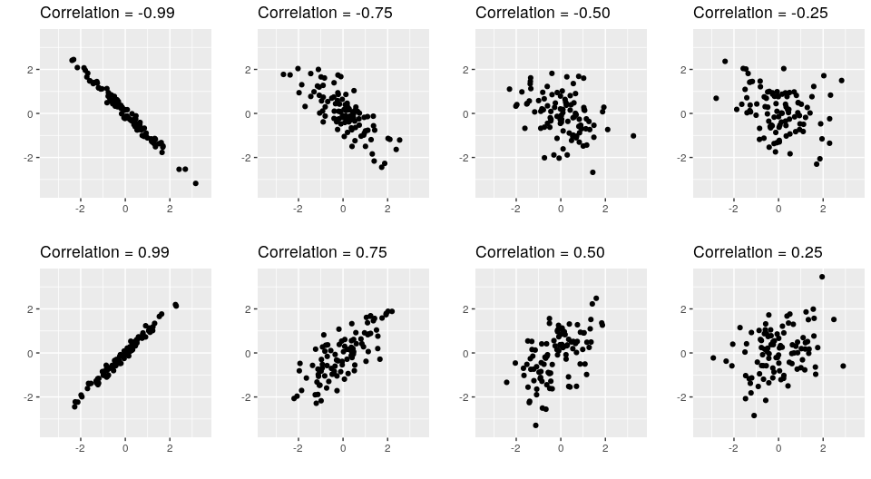
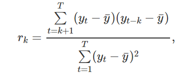
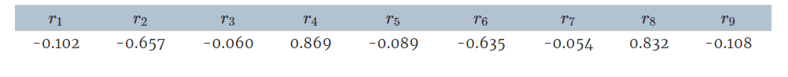
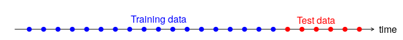
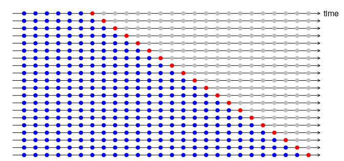
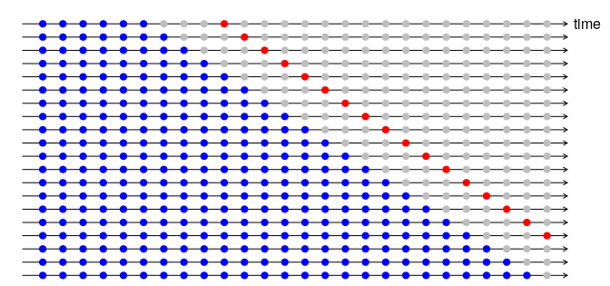

 
 ```{r setup, include = TRUE}
knitr::opts_chunk$set(include = TRUE, echo = TRUE)
library(forecast)
library(fpp2)
library(ggplot2)
```

## 1. Defining a **ts** object 
### a) using the **ts** function 

##### *main arguments*
* **data** = a vector or matrix of the observed time-series values. A data frame will be coerced to a numeric matrix via data.matrix; defaults to *NA* 
* **start** = the time of the first observation. Either a single number or a vector of two integers, which specify a natural time unit and a (1-based) number of samples into the time unit. See the examples for the use of the second form; defaults to *1* 
* **end** = the time of the last observation, specified in the same way as start; defaults to *numeric()* 
* **frequency** = the number of observations per unit of time; defaults to *1*

##### *other useful arguments*
* **deltat** = the fraction of the sampling period between successive observations; e.g., 1/12 for monthly data. Only one of frequency or deltat should be provided; defaults to *1*
* **ts.eps** = time series comparison tolerance. Frequencies are considered equal if their absolute difference is less than ts.eps; defaults to *getOption("ts.eps")*
* **class** = class to be given to the result, or none if NULL or "none". The default is "ts" for a single series, c("mts", "ts", "matrix") for multiple series;
* **names** = a character vector of names for the series in a multiple series: defaults to the colnames of data, or Series 1, Series 2, ....;

```{r}
y <- ts(c(123,39,78,52,110), start=2012)
y
```

#### If you have annual data, with one observation per year, you only need to provide the starting year (or the ending year).

#### For observations that are more frequent than once per year, you simply add a **frequency** argument. For example, if your monthly data is already stored as a numerical vector **z**, then it can be converted to a **ts** object like this:

```{r}
# controlling the number of observations per unit of time with "frequency"
z <- c(123,39,78,52,110)
y <- ts(z, start=2003, frequency=12) # the default frequency = 1
y
```


## 2. Time plots


#### For time series data, the obvious graph to start with is a time plot. That is, the observations are plotted against the time of observation, with consecutive observations joined by straight lines. The figure below shows the weekly economy passenger load on Ansett Airlines between Australia’s two largest cities.

```{r}
autoplot(melsyd[,"Economy.Class"]) + # The Autoplot() command will produces an appropriate plot of whatever is passed as its first argument.
  ggtitle("Economy class passengers: Melbourne-Sydney") + # ggtitle() command will set the title of the graph
  xlab("Year") + #  xlab() and ylab() commands will set the labels of the graph
  ylab("Thousands")
```


#### Any model will need to take all these features into account in order to effectively forecast the passenger load into the future.


```{r}
autoplot(a10) +
  ggtitle("Antidiabetic drug sales") +
  ylab("$ million") +
  xlab("Year")
```


#### Here, there is a clear and increasing trend. There is also a strong seasonal pattern that increases in size as the level of the series increases. The sudden drop at the start of each year is caused by a government subsidisation scheme that makes it cost-effective for patients to stockpile drugs at the end of the calendar year. Any forecasts of this series would need to capture the seasonal pattern, and the fact that the trend is changing slowly.


## 3. Time series patterns


### Terms needed for describing time series:


### **3.1 Trend:**


#### A trend exists when there is a long-term increase or decrease in the data. It does not have to be linear. Sometimes we will refer to a trend as “changing direction”, when it might go from an increasing trend to a decreasing trend. There is a trend in the antidiabetic drug sales data shown in the last figure.


### **3.2 Seasonal:**


#### A seasonal pattern occurs when a time series is affected by seasonal factors such as the time of the year or the day of the week. Seasonality is always of a fixed and known frequency. The monthly sales of antidiabetic drugs above shows seasonality which is induced partly by the change in the cost of the drugs at the end of the calendar year.


### **3.3 Cyclic:**


#### A cycle occurs when the data exhibit rises and falls that are not of a fixed frequency. These fluctuations are usually due to economic conditions, and are often related to the “business cycle”. The duration of these fluctuations is usually at least 2 years.


<center>

</center>

#### 1. The monthly housing sales (top left) show strong seasonality within each year, as well as some strong cyclic behaviour with a period of about 6–10 years. There is no apparent trend in the data over this period.

#### 2. The US treasury bill contracts (top right) show results from the Chicago market for 100 consecutive trading days in 1981. Here there is no seasonality, but an obvious downward trend. Possibly, if we had a much longer series, we would see that this downward trend is actually part of a long cycle, but when viewed over only 100 days it appears to be a trend.

#### 3. The Australian quarterly electricity production (bottom left) shows a strong increasing trend, with strong seasonality. There is no evidence of any cyclic behaviour here.

#### 4. The daily change in the Google closing stock price (bottom right) has no trend, seasonality or cyclic behaviour. There are random fluctuations which do not appear to be very predictable, and no strong patterns that would help with developing a forecasting model.


## 4. Seasonal plots


#### A seasonal plot is similar to a time plot except that the data are plotted against the individual “seasons” in which the data were observed. An example is given below showing the antidiabetic drug sales.


``` {r}
ggseasonplot(a10, year.labels=TRUE, year.labels.left=TRUE) + # a10 = a time series object, year.labels = a logical flag indicating wheter labels for each year of data should be plotted on the right
  ylab("$ million") +
  ggtitle("Seasonal plot: antidiabetic drug sales")
```


#### These are exactly the same data as were shown earlier, but now the data from each season are overlapped. A seasonal plot allows the underlying seasonal pattern to be seen more clearly, and is especially useful in identifying years in which the pattern changes.

#### A useful variation on the seasonal plot uses polar coordinates. Setting polar=TRUE makes the time series axis circular rather than horizontal, as shown below.

``` {r}
ggseasonplot(a10, polar=TRUE) +
  ylab("$ million") +
  ggtitle("Polar seasonal plot: antidiabetic drug sales")
```


## 5. Seasonal subseries plots


#### An alternative plot that emphasises the seasonal patterns is where the data for each season are collected together in separate mini time plots.

```{r}
ggsubseriesplot(a10) +
  ylab("$ million") +
  ggtitle("Seasonal subseries plot: antidiabetic drug sales")
```


#### The horizontal lines indicate the means for each month. This form of plot enables the underlying seasonal pattern to be seen clearly, and also shows the changes in seasonality over time. It is especially useful in identifying changes within particular seasons. In this example, the plot is not particularly revealing; but in some cases, this is the most useful way of viewing seasonal changes over time.


## 6. Scatterplots


#### The graphs discussed so far are useful for visualising individual time series. It is also useful to explore relationships between time series. The next figure shows  two time series: half-hourly electricity demand (in Gigawatts) and temperature (in degrees Celsius), for 2014 in Victoria, Australia. The temperatures are for Melbourne, the largest city in Victoria, while the demand values are for the entire state.


```{r}
autoplot(elecdemand[,c("Demand","Temperature")], facets=TRUE) +
  xlab("Year: 2014") + ylab("") +
  ggtitle("Half-hourly electricity demand: Victoria, Australia")
```


#### We can study the relationship between demand and temperature by plotting one series against the other.


```{r}
qplot(Temperature, Demand, data=as.data.frame(elecdemand)) + # dataframe to use, if not specified, will create one, extracting vectors from current environment
  ylab("Demand (GW)") + xlab("Temperature (Celsius)")
```


### **6.1. Correlation**


#### It is common to compute correlation coefficients to measure the strength of the relationship between two variables. The correlation between variables **x** and **y** is given by:


<center>
$r = \frac{\sum (x_{t} - \bar{x})(y_{t}-\bar{y})}{\sqrt{\sum(x_{t}-\bar{x})^2}\sqrt{\sum(y_{t}-\bar{y})^2}}.$
<center>


#### The value of **r** always lies between **−1** and **1** with negative values indicating a negative relationship and positive values indicating a positive relationship. The following graphs show examples of data sets with varying levels of correlation.


<center>

<center>


<center>

<center>


#### The plots in the last figure all have correlation coefficients of 0.82, but they have very different relationships. This shows how important it is to look at the plots of the data and not simply rely on correlation values.


### **6.2. Scatterplot matrices**


#### When there are several potential predictor variables, it is useful to plot each variable against each other variable, as in showing quarterly visitor numbers for five regions of New South Wales, Australia.


```{r}
autoplot(visnights[,1:5], facets=TRUE) +
  ylab("Number of visitor nights each quarter (millions)")
```


#### To see the relationships between these five time series, we can plot each time series against the others. These plots can be arranged in a scatterplot matrix:


```{r}
GGally::ggpairs(as.data.frame(visnights[,1:5]))
```


#### For each panel, the variable on the vertical axis is given by the variable name in that row, and the variable on the horizontal axis is given by the variable name in that column. There are many options available to produce different plots within each panel. In the default version, the correlations are shown in the upper right half of the plot, while the scatterplots are shown in the lower half. On the diagonal are shown density plots.

#### The value of the scatterplot matrix is that it enables a quick view of the relationships between all pairs of variables. In this example, the second column of plots shows there is a strong positive relationship between visitors to the NSW north coast and visitors to the NSW south coast, but no detectable relationship between visitors to the NSW north coast and visitors to the NSW south inland.


## 7. Lag plots


#### The next figure displays scatterplots of quarterly Australian beer production, where the horizontal axis shows lagged values of the time series. Each graph shows **$y_{t}$** plotted against **$y_{t-k}$** for different values of k.


```{r}
beer2 <- window(ausbeer, start=1992) # window() = a generic function which extracts the subset of the object x between start and end
gglagplot(beer2)
```


#### Here the colours indicate the quarter of the variable on the vertical axis. The lines connect points in chronological order. The relationship is strongly positive at lags 4 and 8, reflecting the strong seasonality in the data. The negative relationship seen for lags 2 and 6 occurs because peaks (in Q4) are plotted against troughs (in Q2).
#### The window() function used here is very useful when extracting a portion of a time series. In this case, we have extracted the data from **ausbeer**, beginning in 1992.


## 8. Autocorelation


#### Autocorrelation measures the linear relationship between lagged values of a time series. The value of $r_{k}$ can be written as:


<center>

<center>


#### The first nine autocorrelation coefficients for the beer production data are given in the following table.


<center>

<center>


#### These correspond to the nine scatterplots, also known as a correlogram.

```{r}
ggAcf(beer2) # plots the autocorelation coefficients using the ACF function()
```


#### **r4** is higher than for the other lags. This is due to the seasonal pattern in the data: the peaks tend to be four quarters apart and the troughs tend to be four quarters apart.
#### **r2** is more negative than for the other lags because troughs tend to be two quarters behind peaks.
#### The dashed blue lines indicate whether the correlations are significantly different from zero.


### **8.1 .Trend and seasonality in ACF plots**


#### When data have a trend, the autocorrelations for small lags tend to be large and positive because observations nearby in time are also nearby in size. So the ACF of trended time series tend to have positive values that slowly decrease as the lags increase.
#### When data are seasonal, the autocorrelations will be larger for the seasonal lags (at multiples of the seasonal frequency) than for other lags.
#### When data are both trended and seasonal, you see a combination of these effects. The monthly Australian electricity demand series plotted next shows both trend and seasonality


```{r}
aelec <- window(elec, start=1980)
autoplot(aelec) + xlab("Year") + ylab("GWh")
```

#### Its ACF is shown as:

```{r}
ggAcf(aelec, lag=48) # lags = number of lag plots desired
```


#### The slow decrease in the ACF as the lags increase is due to the trend, while the “scalloped” shape is due the seasonality.


## 9. White noise


#### Time series that show no autocorrelation are called white noise. The next figure illustrates an example of white noise.


```{r}
set.seed(30) # set a reproductable sequence random result, in this case 30
y <- ts(rnorm(50)) # ts object of a 50 normal distribution
autoplot(y) + ggtitle("White noise") # plot the ts object
```


#### For white noise series, we expect each autocorrelation to be close to zero. Of course, they will not be exactly equal to zero as there is some random variation. For a white noise series, we expect 95% of the spikes in the ACF to lie within $\pm 2/\sqrt{T}$ where T is the length of the time series.
 
#### In this example, T=50 and so the bounds are at $\pm 2/\sqrt{50}$ = $\pm 0.28$. All of the autocorrelation coefficients lie within these limits, confirming that the data are white noise.


```{r}
ggAcf(y) # plots the Acf of white noise, expected to lie between (+/-)(2/sqrt(T)). In this example T = 50.
```


## Exercices


### 1. Use the help function to explore what the series gold, woolyrnq and gas represent.

```{r}
help(gold)
help(woolyrnq)
help(gas)
```


#### a. Use autoplot() to plot each of these in separate plots.


```{r}
autoplot(gold)
autoplot(woolyrnq)
autoplot(gas)
```


#### What is the frequency of each series? Hint: apply the frequency() function.


```{r}
print("Frequency")
print("gold")
frequency(gold)
print("woolyrnq")
frequency(woolyrnq)
print("gas")
frequency(gas)
```


#### Use which.max() to spot the outlier in the gold series. Which observation was it?


```{r}
print("When gold got maximum value?")
which.max(gold)
print("What was the gold's maximum value?")
gold[which.max(gold)]
```


#### 2. Download the file tute1.csv from the book website, open it in Excel (or some other spreadsheet application), and review its contents. You should find four columns of information. Columns B through D each contain a quarterly series, labelled Sales, AdBudget and GDP. Sales contains the quarterly sales for a small company over the period 1981-2005. AdBudget is the advertising budget and GDP is the gross domestic product. All series have been adjusted for inflation.


#### a. You can read the data into R with the following script:


```{r}
tute1 <- read.csv("./tute1.csv", header=TRUE)
View(tute1)
```


#### b. Convert the data to time series


```{r}
mytimeseries <- ts(tute1[,-1], start=1981, frequency=4)
```


# c. Construct time series plots of each of the three series


```{r}
autoplot(mytimeseries, facets=TRUE)
autoplot(mytimeseries)
```


#### 5. Use the ggseasonplot() and ggsubseriesplot() functions to explore the seasonal patterns in the following time series: writing, fancy, a10, h02.
#### a) What can you say about the seasonal patterns?
#### b) Can you identify any unusual years?

```{r}
ggseasonplot(writing)
ggsubseriesplot(writing)
# The sales amount of paper falls down in August annually
```

```{r}
ggseasonplot(fancy)
ggsubseriesplot(fancy)
# In December, 1992 the monthly sales for a souvenir shop increased dramatically compared to the same month of the last year
```

```{r}
ggseasonplot(a10)
ggsubseriesplot(a10)
# The amount of antidiabetes monthly scripts falls down in February annually
```

```{r}
ggseasonplot(h02)
ggsubseriesplot(h02)
# The amount of corticosteroid monthly scripts also falls down in February annually
```


## 10. Some simple forecasting methods

#### Some forecasting methods are extremely simple and surprisingly effective. We will use the following four forecasting methods as benchmarks throughout this book.

### **10.1. Average method**

#### Here, the forecasts of all future values are equal to the average (or "mean") of the historical data. If we let the historical data be denoted by $y_{1},\dots,y_{T}$, then we can write the forecasts as 

<center>
$\hat{y}_{T+h|T} = \bar{y} = (y_{1}+\dots+y_{T})/T.$
</center>

#### The notation $\hat{y}_{T+h|T}$ is a short-hand for the estimate of $y_{T+h}$ based on the data $y_1,\dots,y_T$.

```{r}
y <- ts(c(123,39,78,52,110), start=2012) # y contains the time series
h = 10 # h is the forecast horizon
meanf(y, h)
```

### **10.2. Naïve method**

#### For naïve forecasts, we simply set all forecasts to be the value of the last observation. That is, 
<center>
$\hat{y}_{T+h|T} = y_{T}.$
</center>

#### This method works remarkably well for many economic and financial time series.

```{r}
y <- ts(c(123,39,78,52,110), start=2012) # y contains the time series
h = 10 # h is the forecast horizon
naive(y, h)
rwf(y, h) # Equivalent alternative
```

#### Because a naïve forecast is optimal when data follow a random walk (see Section 8.1), these are also called random **walk forecasts.**

### **10.3. Seasonal naïve method**

#### A similar method is useful for highly seasona l data. In this case, we set each forecast to be equal to the last observed value from the same season of the year (e.g., the same month of the previous year). Formally, the forecast for time $T+h$ is written as

<center>
$\hat{y}_{T+h|T} = y_{T+h-m(k+1)},$
</center>

#### where $m=$ the seasonal period, and $k$ is the integer part of $(h−1)/m$ (i.e., the number of complete years in the forecast period prior to time $T+h$). This looks more complicated than it really is. For example, with monthly data, the forecast for all future February values is equal to the last observed February value. With quarterly data, the forecast of all future Q2 values is equal to the last observed Q2 value (where Q2 means the second quarter). Similar rules apply for other months and quarters, and for other seasonal periods.

```{r}
y <- ts(c(123,39,78,52,110), start=2012) # y contains the time series
h = 10 # h is the forecast horizon
snaive(y, h)
```

### **10.4. Drift method**

#### A variation on the naïve method is to allow the forecasts to increase or decrease over time, where the amount of change over time (called the **drift**) is set to be the average change seen in the historical data. Thus the forecast for time $T+h$ is given by 

<center>
$\hat{y}_{T+h|T} = y_{T} + \frac{h}{T-1}\sum_{t=2}^T (y_{t}-y_{t-1}) = y_{T} + h \left( \frac{y_{T} -y_{1}}{T-1}\right).$
</center>

#### This is equivalent to drawing a line between the first and last observations, and extrapolating it into the future.

```{r}
y <- ts(c(123,39,78,52,110), start=2012) # y contains the time series
h = 10 # h is the forecast horizon
rwf(y, h, drift=TRUE)
```

### **10.5. Examples**

#### The Figure bellow shows the first three methods applied to the quarterly beer production data.

```{r}
# Set training data from 1992 to 2007
beer2 <- window(ausbeer,start=1992,end=c(2007,4))
# Plot some forecasts
autoplot(beer2) +
  autolayer(meanf(beer2, h=11),
    series="Mean", PI=FALSE) +
  autolayer(naive(beer2, h=11),
    series="Naïve", PI=FALSE) +
  autolayer(snaive(beer2, h=11),
    series="Seasonal naïve", PI=FALSE) +
  ggtitle("Forecasts for quarterly beer production") +
  xlab("Year") + ylab("Megalitres") +
  guides(colour=guide_legend(title="Forecast"))
```

#### The Figure bellow, the non-seasonal methods are applied to a series of 200 days of the Google daily closing stock price.

```{r}
autoplot(goog200) +
  autolayer(meanf(goog200, h=40),
    series="Mean", PI=FALSE) +
  autolayer(rwf(goog200, h=40),
    series="Naïve", PI=FALSE) +
  autolayer(rwf(goog200, drift=TRUE, h=40),
    series="Drift", PI=FALSE) +
  ggtitle("Google stock (daily ending 6 Dec 2013)") +
  xlab("Day") + ylab("Closing Price (US$)") +
  guides(colour=guide_legend(title="Forecast"))
```

#### Sometimes one of these simple methods will be the best forecasting method available; but in many cases, these methods will serve as benchmarks rather than the method of choice. That is, any forecasting methods we develop will be compared to these simple methods to ensure that the new method is better than these simple alternatives. If not, the new method is not worth considering.

## 11. Transformations and adjustments

### **11.1 Calendar adjustments**

### Some of the variation seen in seasonal data may be due to simple calendar effects. In such cases, it is usually much easier to remove the variation before fitting a forecasting model. The ```monthdays()``` function will compute the number of days in each month or quarter.

### For example, if you are studying the monthly milk production on a farm, there will be variation between the months simply because of the different numbers of days in each month, in addition to the seasonal variation across the year.

```{r}
dframe <- cbind(Monthly = milk,
                DailyAverage = milk/monthdays(milk))
  autoplot(dframe, facet=TRUE) +
    xlab("Years") + ylab("Pounds") +
    ggtitle("Milk production per cow")
```

### **11.2 Population adjustments**

#### Any data that are affected by population changes can be adjusted to give per-capita data. That is, consider the data per person (or per thousand people, or per million people) rather than the total. For example, if you are studying the number of hospital beds in a particular region over time, the results are much easier to interpret if you remove the effects of population changes by considering the number of beds per thousand people. Then you can see whether there have been real increases in the number of beds, or whether the increases are due entirely to population increases. It is possible for the total number of beds to increase, but the number of beds per thousand people to decrease. This occurs when the population is increasing faster than the number of hospital beds. For most data that are affected by population changes, it is best to use per-capita data rather than the totals.

### **11.3 Inflation adjustments**

#### Data which are affected by the value of money are best adjusted before modelling. For example, the average cost of a new house will have increased over the last few decades due to inflation. A $200,000 house this year is not the same as a $200,000 house twenty years ago. For this reason, financial time series are usually adjusted so that all values are stated in dollar values from a particular year. For example, the house price data may be stated in year 2000 dollars.

#### To make these adjustments, a price index is used. If $z_{t}$ denotes the price index and $y_{t}$ denotes the original house price in year $t$, then $x_{t} = y_{t}/z_{t} * z_{2000}$ gives the adjusted house price at year 2000 dollar values. Price indexes are often constructed by government agencies. For consumer goods, a common price index is the Consumer Price Index (or CPI).

### **11.4 Mathematical transformations**

#### If the data show variation that increases or decreases with the level of the series, then a transformation can be useful. For example, a logarithmic transformation is often useful. If we denote the original observations as $y_{1},\dots,y_{T}$ and the transformed observations as $w_{1}, \dots, w_{T}$, then $w_t = \log(y_t)$. Logarithms are useful because they are interpretable: changes in a log value are relative (or percentage) changes on the original scale. So if log base 10 is used, then an increase of 1 on the log scale corresponds to a multiplication of 10 on the original scale. Another useful feature of log transformations is that they constrain the forecasts to stay positive on the original scale.

#### Sometimes other transformations are also used (although they are not so interpretable). For example, square roots and cube roots can be used. These are called **power transformations** because they can be written in the form $w_{t} = y_{t}^p$

#### A useful family of transformations, that includes both logarithms and power transformations, is the family of Box-Cox transformations, which depend on the parameter λ and are defined as follows: 

<center>
$
  w_t  =
    \begin{cases}
      \log(y_t) & \text{if $\lambda=0$};  \\
      (y_t^\lambda-1)/\lambda & \text{otherwise}.
    \end{cases}
$
</center>

#### The logarithm in a Box-Cox transformation is always a natural logarithm (i.e., to base e). So if λ=0, natural logarithms are used, but if λ≠0, a power transformation is used, followed by some simple scaling.

#### If λ=1, then $w_t = y_t-1$, so the transformed data is shifted downwards but there is no change in the shape of the time series. But for all other values of λ, the time series will change shape.

#### The ```BoxCox.lambda()``` function will choose a value of lambda for you.

```{r}
(lambda <- BoxCox.lambda(elec))
#> [1] 0.2654
autoplot(BoxCox(elec,lambda))
```

#### Having chosen a transformation, we need to forecast the transformed data. Then, we need to reverse the transformation (or back-transform) to obtain forecasts on the original scale. The reverse Box-Cox transformation is given by 

<center>
$\begin{equation}
\tag{3.1}
  y_{t} =
    \begin{cases}
      \exp(w_{t}) & \text{if $\lambda=0$};\\
      (\lambda w_t+1)^{1/\lambda} & \text{otherwise}.
    \end{cases}
\end{equation}$
</center>

### **11.5 Features of power transformations**

* #### If some $y_{t}\le0$, no power transformation is possible unless all observations are adjusted by adding a constant to all values.
* #### Choose a simple value of λ. It makes explanations easier.
* #### The forecasting results are relatively insensitive to the value of λ.
* #### Often no transformation is needed.
* #### Transformations sometimes make little difference to the forecasts but have a large effect on prediction intervals.

### **11.6 Bias adjustments**

#### One issue with using mathematical transformations such as Box-Cox transformations is that the back-transformed point forecast will not be the mean of the forecast distribution. In fact, it will usually be the median of the forecast distribution (assuming that the distribution on the transformed space is symmetric). For many purposes, this is acceptable, but occasionally the mean forecast is required. For example, you may wish to add up sales forecasts from various regions to form a forecast for the whole country. But medians do not add up, whereas means do.

#### For a Box-Cox transformation, the back-transformed mean is given by 

<center>
$
\begin{equation}
\tag{3.2}
y_t =
  \begin{cases}
     \exp(w_t)\left[1 + \frac{\sigma_h^2}{2}\right] & \text{if $\lambda=0$;}\\
     (\lambda w_t+1)^{1/\lambda}\left[1 + \frac{\sigma_h^2(1-\lambda)}{2(\lambda w_t+1)^{2}}\right] & \text{otherwise;}
  \end{cases}
\end{equation}
$
</center>

#### where $\sigma_h^2$ is the ***h***-step forecast variance. The larger the forecast variance, the bigger the difference between the mean and the median.

#### The difference between the simple back-transformed forecast given by (3.1) and the mean given by (3.2) is called the **bias**. When we use the mean, rather than the median, we say the point forecasts have been **bias-adjusted**.

#### To see how much difference this bias-adjustment makes, consider the following example, where we forecast average annual price of eggs using the drift method with a log transformation (λ=0). The log transformation is useful in this case to ensure the forecasts and the prediction intervals stay positive.

```{r}
fc <- rwf(eggs, drift=TRUE, lambda=0, h=50, level=80)
fc2 <- rwf(eggs, drift=TRUE, lambda=0, h=50, level=80,
  biasadj=TRUE)
autoplot(eggs) +
  autolayer(fc, series="Simple back transformation") +
  autolayer(fc2, series="Bias adjusted", PI=FALSE) +
  guides(colour=guide_legend(title="Forecast"))
```

#### The blue line in above shows the forecast medians while the red line shows the forecast means. Notice how the skewed forecast distribution pulls up the point forecast when we use the bias adjustment.

#### Bias adjustment is not done by default in the **forecast** package. If you want your forecasts to be means rather than medians, use the argument ```biasadj=TRUE``` when you select your Box-Cox transformation parameter.

## 12. Residual diagnostics

### **12.1 Fitted values**

#### Each observation in a time series can be forecast using all previous observations. We call these **fitted values** and they are denoted by $\hat{y}_{t|t-1}$, meaning the forecast of $y_t$ based on observations $y_{1},\dots,y_{t-1}$. We use these so often, we sometimes drop part of the subscript and just write $\hat{y}_t$ instead of $\hat{y}_{t|t-1}$. Fitted values always involve one-step forecasts.

#### Actually, fitted values are often not true forecasts because any parameters involved in the forecasting method are estimated using all available observations in the time series, including future observations. For example, if we use the average method, the fitted values are given by 

<center>
$\hat{y}_t = \hat{c}$
</center>

#### where $\hat{c}$ is the average computed over all available observations, including those at times *after* $t$. Similarly, for the drift method, the drift parameter is estimated using all available observations. In this case, the fitted values are given by 

<center>
$\hat{y}_t = y_{t-1} + \hat{c}$
</center>

#### where $\hat{c} = (y_T-y_1)/(T-1)$. In both cases, there is a parameter to be estimated from the data. The “hat” above the $c$ reminds us that this is an estimate. When the estimate of $c$ involves observations after time $t$, the fitted values are not true forecasts. On the other hand, naïve or seasonal naïve forecasts do not involve any parameters, and so fitted values are true forecasts in such cases.

### **12.2 Residuals**

#### The “residuals” in a time series model are what is left over after fitting a model. For many (but not all) time series models, the residuals are equal to the difference between the observations and the corresponding fitted values: 

<center>
$e_{t} = y_{t}-\hat{y}_{t}.$ 
</center>

#### Residuals are useful in checking whether a model has adequately captured the information in the data. A good forecasting method will yield residuals with the following properties:

1. #### The residuals are uncorrelated. If there are correlations between residuals, then there is information left in the residuals which should be used in computing forecasts.

2. #### The residuals have zero mean. If the residuals have a mean other than zero, then the forecasts are biased.

#### Any forecasting method that does not satisfy these properties can be improved. However, that does not mean that forecasting methods that satisfy these properties cannot be improved. It is possible to have several different forecasting methods for the same data set, all of which satisfy these properties. Checking these properties is important in order to see whether a method is using all of the available information, but it is not a good way to select a forecasting method.

#### If either of these properties is not satisfied, then the forecasting method can be modified to give better forecasts. Adjusting for bias is easy: if the residuals have mean m, then simply add m to all forecasts and the bias problem is solved. Fixing the correlation problem is harder, and we will not address it until Chapter 9.

#### In addition to these essential properties, it is useful (but not necessary) for the residuals to also have the following two properties.

3. #### The residuals have constant variance.
4. #### The residuals are normally distributed.

#### These two properties make the calculation of prediction intervals easier (see Section 3.5 for an example). However, a forecasting method that does not satisfy these properties cannot necessarily be improved. Sometimes applying a Box-Cox transformation may assist with these properties, but otherwise there is usually little that you can do to ensure that your residuals have constant variance and a normal distribution. Instead, an alternative approach to obtaining prediction intervals is necessary. Again, we will not address how to do this until later in the book.

### **12.3 Example: Forecasting the Google daily closing stock price**

#### For stock market prices and indexes, the best forecasting method is often the naïve method. That is, each forecast is simply equal to the last observed value, or $\hat{y}_{t} = y_{t-1}$. Hence, the residuals are simply equal to the difference between consecutive observations:

<center>
$e_{t} = y_{t} - \hat{y}_{t} = y_{t} - y_{t-1}.$
</center>

#### The following graph shows the Google daily closing stock price (GOOG). The large jump at day 166 corresponds to 18 October 2013 when the price jumped 12% due to unexpectedly strong third quarter results.

```{r}
autoplot(goog200) +
  xlab("Day") + ylab("Closing Price (US$)") +
  ggtitle("Google Stock (daily ending 6 December 2013)")
```

#### The residuals obtained from forecasting this series using the naïve method are shown above. The large positive residual is a result of the unexpected price jump at day 166.

```{r}
res <- residuals(naive(goog200))
autoplot(res) + xlab("Day") + ylab("") +
  ggtitle("Residuals from naïve method")
```

```{r}
gghistogram(res) + ggtitle("Histogram of residuals")
```

```{r}
ggAcf(res) + ggtitle("ACF of residuals")
```

#### These graphs show that the naïve method produces forecasts that appear to account for all available information. The mean of the residuals is close to zero and there is no significant correlation in the residuals series. The time plot of the residuals shows that the variation of the residuals stays much the same across the historical data, apart from the one outlier, and therefore the residual variance can be treated as constant. This can also be seen on the histogram of the residuals. The histogram suggests that the residuals may not be normal — the right tail seems a little too long, even when we ignore the outlier. Consequently, forecasts from this method will probably be quite good, but prediction intervals that are computed assuming a normal distribution may be inaccurate.

### **12.4 Portmanteau tests for autocorrelation**

#### In addition to looking at the ACF plot, we can also do a more formal test for autocorrelation by considering a whole set of $r_k$ values as a group, rather than treating each one separately.

#### Recall that $r_k$ is the autocorrelation for lag $k$. When we look at the ACF plot to see whether each spike is within the required limits, we are implicitly carrying out multiple hypothesis tests, each one with a small probability of giving a false positive. When enough of these tests are done, it is likely that at least one will give a false positive, and so we may conclude that the residuals have some remaining autocorrelation, when in fact they do not.

#### In order to overcome this problem, we test whether the first $h$ autocorrelations are significantly different from what would be expected from a white noise process. A test for a group of autocorrelations is called a **portmanteau test**, from a French word describing a suitcase containing a number of items.

#### One such test is the Box-Pierce test, based on the following statistic 

<center>
$Q = T \sum_{k=1}^h r_k^2,$
</center>

#### where $h$ is the maximum lag being considered and $T$ is the number of observations. If each $r_k$ is close to zero, then $Q$ will be small. If some $r_k$ values are large (positive or negative), then $Q$ will be large. We suggest using $h=10$ for non-seasonal data and $h=2m$ for seasonal data, where $m$ is the period of seasonality. However, the test is not good when $h$ is large, so if these values are larger than $T/5$, then use $h=T/5$

#### A related (and more accurate) test is the **Ljung-Box test**, based on 

<center>
$Q^* = T(T+2) \sum_{k=1}^h (T-k)^{-1}r_k^2.$
</center>

#### Again, large values of $Q^*$ suggest that the autocorrelations do not come from a white noise series.

#### How large is too large? If the autocorrelations did come from a white noise series, then both $Q$ and $Q^*$ would have a $\chi^2$ distribution with $(h - K)$ degrees of freedom, where $K$ is the number of parameters in the model. If they are calculated from raw data (rather than the residuals from a model), then set $K=0$.

#### For the Google stock price example, the naïve model has no parameters, so K=0 in that case also.

```{r}
# lag=h and fitdf=K
Box.test(res, lag=10, fitdf=0)
#> 
#>  Box-Pierce test
#> 
#> data:  res
#> X-squared = 11, df = 10, p-value = 0.4

Box.test(res,lag=10, fitdf=0, type="Lj")
#> 
#>  Box-Ljung test
#> 
#> data:  res
#> X-squared = 11, df = 10, p-value = 0.4
```

#### For both $Q$ and $Q^∗$, the results are not significant (i.e., the $p$-values are relatively large). Thus, we can conclude that the residuals are not distinguishable from a white noise series.

#### All of these methods for checking residuals are conveniently packaged into one R function ```checkresiduals()```, which will produce a time plot, ACF plot and histogram of the residuals (with an overlaid normal distribution for comparison), and do a Ljung-Box test with the correct degrees of freedom.

```{r}
checkresiduals(naive(goog200))
```

```{r}
#> 
#>  Ljung-Box test
#> 
#> data:  Residuals from Naive method
#> Q* = 11, df = 10, p-value = 0.4
#> 
#> Model df: 0.   Total lags used: 10
```

## 13. Evaluating forecast accuracy

### **13.1 Training and test sets**

#### It is important to evaluate forecast accuracy using genuine forecasts. Consequently, the size of the residuals is not a reliable indication of how large true forecast errors are likely to be. The accuracy of forecasts can only be determined by considering how well a model performs on new data that were not used when fitting the model.

#### When choosing models, it is common practice to separate the available data into two portions, **training** and **test** data, where the training data is used to estimate any parameters of a forecasting method and the test data is used to evaluate its accuracy. Because the test data is not used in determining the forecasts, it should provide a reliable indication of how well the model is likely to forecast on new data.

<center>

</center>

#### The size of the test set is typically about 20% of the total sample, although this value depends on how long the sample is and how far ahead you want to forecast. The test set should ideally be at least as large as the maximum forecast horizon required. The following points should be noted.

* #### A model which fits the training data well will not necessarily forecast well.
* #### A perfect fit can always be obtained by using a model with enough parameters.
* #### Over-fitting a model to data is just as bad as failing to identify a systematic pattern in the data.

#### Some references describe the test set as the “hold-out set” because these data are “held out” of the data used for fitting. Other references call the training set the “in-sample data” and the test set the “out-of-sample data”. We prefer to use “training data” and “test data” in this book.

### **13.2 Functions to subset a time series**

#### The ```window()``` function introduced in Chapter 2 is useful when extracting a portion of a time series, such as we need when creating training and test sets. In the ```window()``` function, we specify the start and/or end of the portion of time series required using time values. For example,

```{r}
window(ausbeer, start=1995)
```

#### extracts all data from 1995 onward.

#### Another useful function is subset() which allows for more types of subsetting. A great advantage of this function is that it allows the use of indices to choose a subset. For example,

```{r}
subset(ausbeer, start=length(ausbeer)-4*5)
```

#### extracts the last 5 years of observations from ```ausbeer```. It also allows extracting all values for a specific season. For example,

```{r}
subset(ausbeer, quarter = 1)
```

#### extracts the first quarters for all years.

#### Finally, ```head``` and ```tail``` are useful for extracting the first few or last few observations. For example, the last 5 years of ```ausbeer``` can also be obtained using

```{r}
tail(ausbeer, 4*5)
```

### **13.3 Forecast errors**

#### A forecast “error” is the difference between an observed value and its forecast. Here “error” does not mean a mistake, it means the unpredictable part of an observation. It can be written as 

<center>
$e_{T+h} = y_{T+h} - \hat{y}_{T+h|T},$
</center>

#### where the training data is given by $\{y_1,\dots,y_T\}$ and the test data is given by $\{y_{T+1},y_{T+2},\dots\}$.

#### Note that forecast errors are different from residuals in two ways. First, residuals are calculated on the training set while forecast errors are calculated on the test set. Second, residuals are based on one-step forecasts while forecast errors can involve multi-step forecasts.

#### We can measure forecast accuracy by summarising the forecast errors in different ways.

### **13.4 Scale-dependent errors**

#### The forecast errors are on the same scale as the data. Accuracy measures that are based only on $e_{t}$ are therefore scale-dependent and cannot be used to make comparisons between series that involve different units.

#### The two most commonly used scale-dependent measures are based on the absolute errors or squared errors: 

<center>
$\begin{align*}
  \text{Mean absolute error: MAE} & = \text{mean}(|e_{t}|),\\
  \text{Root mean squared error: RMSE} & = \sqrt{\text{mean}(e_{t}^2)}.
\end{align*}$
</center>

#### When comparing forecast methods applied to a single time series, or to several time series with the same units, the MAE is popular as it is easy to both understand and compute. A forecast method that minimises the MAE will lead to forecasts of the median, while minimising the RMSE will lead to forecasts of the mean. Consequently, the RMSE is also widely used, despite being more difficult to interpret.

### **13.5 Percentage errors**

#### The percentage error is given by $p_{t} = 100 e_{t}/y_{t}$. Percentage errors have the advantage of being unit-free, and so are frequently used to compare forecast performances between data sets. The most commonly used measure is: 

<center>
$\text{Mean absolute percentage error: MAPE} = \text{mean}(|p_{t}|).$
</center>

#### Measures based on percentage errors have the disadvantage of being infinite or undefined if $y_{t}=0$ for any $t$ in the period of interest, and having extreme values if any $y_{t}$ is close to zero. Another problem with percentage errors that is often overlooked is that they assume the unit of measurement has a meaningful zero. For example, a percentage error makes no sense when measuring the accuracy of temperature forecasts on either the Fahrenheit or Celsius scales, because temperature has an arbitrary zero point.

#### They also have the disadvantage that they put a heavier penalty on negative errors than on positive errors. This observation led to the use of the so-called “symmetric” MAPE (sMAPE) proposed by Armstrong (1978, p. 348), which was used in the M3 forecasting competition. It is defined by 

<center>
$\text{sMAPE} = \text{mean}\left(200|y_{t} - \hat{y}_{t}|/(y_{t}+\hat{y}_{t})\right).$
</center>

#### However, if yt is close to zero, ^yt is also likely to be close to zero. Thus, the measure still involves division by a number close to zero, making the calculation unstable. Also, the value of sMAPE can be negative, so it is not really a measure of “absolute percentage errors” at all.

#### Hyndman & Koehler (2006) recommend that the sMAPE not be used. It is included here only because it is widely used, although we will not use it in this book.

### **13.5 Scaled errors**

#### Scaled errors were proposed by Hyndman & Koehler (2006) as an alternative to using percentage errors when comparing forecast accuracy across series with different units. They proposed scaling the errors based on the training MAE from a simple forecast method.

#### For a non-seasonal time series, a useful way to define a scaled error uses naïve forecasts: 

<center>
$q_{j} = \frac{\displaystyle e_{j}}
    {\displaystyle\frac{1}{T-1}\sum_{t=2}^T |y_{t}-y_{t-1}|}.$
</center>

#### Because the numerator and denominator both involve values on the scale of the original data, $q_{j}$ is independent of the scale of the data. A scaled error is less than one if it arises from a better forecast than the average naïve forecast computed on the training data. Conversely, it is greater than one if the forecast is worse than the average naïve forecast computed on the training data.

#### For seasonal time series, a scaled error can be defined using seasonal naïve forecasts: 

<center>
$q_{j} = \frac{\displaystyle e_{j}}
    {\displaystyle\frac{1}{T-m}\sum_{t=m+1}^T |y_{t}-y_{t-m}|}.$
</center>

#### The mean absolute scaled error is simply 

<center>
$\text{MASE} = \text{mean}(|q_{j}|).$
</center>

### **13.6 Examples**

```{r}
beer2 <- window(ausbeer,start=1992,end=c(2007,4))
beerfit1 <- meanf(beer2,h=10)
beerfit2 <- rwf(beer2,h=10)
beerfit3 <- snaive(beer2,h=10)
autoplot(window(ausbeer, start=1992)) +
  autolayer(beerfit1, series="Mean", PI=FALSE) +
  autolayer(beerfit2, series="Naïve", PI=FALSE) +
  autolayer(beerfit3, series="Seasonal naïve", PI=FALSE) +
  xlab("Year") + ylab("Megalitres") +
  ggtitle("Forecasts for quarterly beer production") +
  guides(colour=guide_legend(title="Forecast"))
```

#### The figure above shows three forecast methods applied to the quarterly Australian beer production using data only to the end of 2007. The actual values for the period 2008–2010 are also shown. We compute the forecast accuracy measures for this period.

```{r}
beer3 <- window(ausbeer, start=2008)
accuracy(beerfit1, beer3)
accuracy(beerfit2, beer3)
accuracy(beerfit3, beer3)
```

#### It is obvious from the graph that the seasonal naïve method is best for these data, although it can still be improved, as we will discover later. Sometimes, different accuracy measures will lead to different results as to which forecast method is best. However, in this case, all of the results point to the seasonal naïve method as the best of these three methods for this data set.

#### To take a non-seasonal example, consider the Google stock price. The following graph shows the 200 observations ending on 6 Dec 2013, along with forecasts of the next 40 days obtained from three different methods.

```{r}
googfc1 <- meanf(goog200, h=40)
googfc2 <- rwf(goog200, h=40)
googfc3 <- rwf(goog200, drift=TRUE, h=40)
autoplot(subset(goog, end = 240)) +
  autolayer(googfc1, PI=FALSE, series="Mean") +
  autolayer(googfc2, PI=FALSE, series="Naïve") +
  autolayer(googfc3, PI=FALSE, series="Drift") +
  xlab("Day") + ylab("Closing Price (US$)") +
  ggtitle("Google stock price (daily ending 6 Dec 13)") +
  guides(colour=guide_legend(title="Forecast"))
```

```{r}
googtest <- window(goog, start=201, end=240)
accuracy(googfc1, googtest)
accuracy(googfc2, googtest)
accuracy(googfc3, googtest)
```

#### Here, the best method is the drift method (regardless of which accuracy measure is used).

### **13.7 Time series cross-validation**

#### A more sophisticated version of training/test sets is time series cross-validation. In this procedure, there are a series of test sets, each consisting of a single observation. The corresponding training set consists only of observations that occurred prior to the observation that forms the test set. Thus, no future observations can be used in constructing the forecast. Since it is not possible to obtain a reliable forecast based on a small training set, the earliest observations are not considered as test sets.

#### The following diagram illustrates the series of training and test sets, where the blue observations form the training sets, and the red observations form the test sets.

<center>

</center>

#### The forecast accuracy is computed by averaging over the test sets. This procedure is sometimes known as “evaluation on a rolling forecasting origin” because the “origin” at which the forecast is based rolls forward in time.

#### With time series forecasting, one-step forecasts may not be as relevant as multi-step forecasts. In this case, the cross-validation procedure based on a rolling forecasting origin can be modified to allow multi-step errors to be used. Suppose that we are interested in models that produce good 4-step-ahead forecasts. Then the corresponding diagram is shown below.

<center>

</center>

#### Time series cross-validation is implemented with the tsCV() function. In the following example, we compare the RMSE obtained via time series cross-validation with the residual RMSE.

```{r}
e <- tsCV(goog200, rwf, drift=TRUE, h=1)
sqrt(mean(e^2, na.rm=TRUE))
#> [1] 6.233
sqrt(mean(residuals(rwf(goog200, drift=TRUE))^2, na.rm=TRUE))
#> [1] 6.169
```

#### As expected, the RMSE from the residuals is smaller, as the corresponding “forecasts” are based on a model fitted to the entire data set, rather than being true forecasts.

#### A good way to choose the best forecasting model is to find the model with the smallest RMSE computed using time series cross-validation.

### **13.8 Pipe operator**

####The ugliness of the above R code makes this a good opportunity to introduce some alternative ways of stringing R functions together. In the above code, we are nesting functions within functions within functions, so you have to read the code from the inside out, making it difficult to understand what is being computed. Instead, we can use the pipe operator ```%>%``` as follows.

```{r}
goog200 %>% tsCV(forecastfunction=rwf, drift=TRUE, h=1) -> e
e^2 %>% mean(na.rm=TRUE) %>% sqrt()
#> [1] 6.233
goog200 %>% rwf(drift=TRUE) %>% residuals() -> res
res^2 %>% mean(na.rm=TRUE) %>% sqrt()
#> [1] 6.169
```

#### The left hand side of each pipe is passed as the first argument to the function on the right hand side. This is consistent with the way we read from left to right in English. When using pipes, all other arguments must be named, which also helps readability. When using pipes, it is natural to use the right arrow assignment ```->``` rather than the left arrow. For example, the third line above can be read as “Take the ```goog200``` series, pass it to ```rwf()``` with ```drift=TRUE```, compute the resulting residuals, and store them as ```res```”.

#### We will use the pipe operator whenever it makes the code easier to read. In order to be consistent, we will always follow a function with parentheses to differentiate it from other objects, even if it has no arguments. See, for example, the use of ```sqrt()``` and ```residuals()``` in the code above.

### **13.9 Example: using tsCV()**

#### The ```goog200``` data includes daily closing stock price of Google Inc from the NASDAQ exchange for 200 consecutive trading days starting on 25 February 2013.

#### The code below evaluates the forecasting performance of 1- to 8-step-ahead naïve forecasts with ```tsCV()```, using MSE as the forecast error measure. The plot shows that the forecast error increases as the forecast horizon increases, as we would expect.

```{r}
e <- tsCV(goog200, forecastfunction=naive, h=8)
# Compute the MSE values and remove missing values
mse <- colMeans(e^2, na.rm = T)
# Plot the MSE values against the forecast horizon
data.frame(h = 1:8, MSE = mse) %>%
  ggplot(aes(x = h, y = MSE)) + geom_point()
```

### **13.10 Bibliography**

#### Armstrong, J. S. (1978). Long-range forecasting: From crystal ball to computer. John Wiley & Sons.

#### Hyndman, R. J., & Koehler, A. B. (2006). Another look at measures of forecast accuracy. International Journal of Forecasting, 22, 679–688. https://robjhyndman.com/publications/automatic-forecasting/

## 14. Prediction intervals

#### As discussed in Section 1.7, a prediction interval gives an interval within which we expect $y_{t}$ to lie with a specified probability. For example, assuming that the forecast errors are normally distributed, a 95% prediction interval for the $h$-step forecast is

<center>
$\hat{y}_{T+h|T} \pm 1.96 \hat\sigma_h,$
</center>

#### where $\hat\sigma_h$ is an estimate of the standard deviation of the $h$-step forecast distribution.

#### More generally, a prediction interval can be written as 

<center>
$\hat{y}_{T+h|T} \pm c \hat\sigma_h$
</center>
  
#### where the multiplier c depends on the coverage probability. In this book we usually calculate 80% intervals and 95% intervals, although any percentage may be used. The following table gives the value of c for a range of coverage probabilities assuming normally distributed forecast errors.

#### Table 3.1: Multipliers to be used for prediction intervals.

<table>
<caption><span id="tab:pcmultipliers">Table 3.1: </span>Multipliers to be used for prediction intervals.</caption>
<thead>
<tr class="header">
<th align="right">Percentage</th>
<th align="right">Multiplier</th>
</tr>
</thead>
<tbody>
<tr class="odd">
<td align="right">50</td>
<td align="right">0.67</td>
</tr>
<tr class="even">
<td align="right">55</td>
<td align="right">0.76</td>
</tr>
<tr class="odd">
<td align="right">60</td>
<td align="right">0.84</td>
</tr>
<tr class="even">
<td align="right">65</td>
<td align="right">0.93</td>
</tr>
<tr class="odd">
<td align="right">70</td>
<td align="right">1.04</td>
</tr>
<tr class="even">
<td align="right">75</td>
<td align="right">1.15</td>
</tr>
<tr class="odd">
<td align="right">80</td>
<td align="right">1.28</td>
</tr>
<tr class="even">
<td align="right">85</td>
<td align="right">1.44</td>
</tr>
<tr class="odd">
<td align="right">90</td>
<td align="right">1.64</td>
</tr>
<tr class="even">
<td align="right">95</td>
<td align="right">1.96</td>
</tr>
<tr class="odd">
<td align="right">96</td>
<td align="right">2.05</td>
</tr>
<tr class="even">
<td align="right">97</td>
<td align="right">2.17</td>
</tr>
<tr class="odd">
<td align="right">98</td>
<td align="right">2.33</td>
</tr>
<tr class="even">
<td align="right">99</td>
<td align="right">2.58</td>
</tr>
</tbody>
</table>

#### The value of prediction intervals is that they express the uncertainty in the forecasts. If we only produce point forecasts, there is no way of telling how accurate the forecasts are. However, if we also produce prediction intervals, then it is clear how much uncertainty is associated with each forecast. For this reason, point forecasts can be of almost no value without the accompanying prediction intervals.

### **14.1 One-step prediction intervals**

#### When forecasting one step ahead, the standard deviation of the forecast distribution is almost the same as the standard deviation of the residuals. (In fact, the two standard deviations are identical if there are no parameters to be estimated, as is the case with the naïve method. For forecasting methods involving parameters to be estimated, the standard deviation of the forecast distribution is slightly larger than the residual standard deviation, although this difference is often ignored.)

#### For example, consider a naïve forecast for the Google stock price data ```goog200```. The last value of the observed series is 531.48, so the forecast of the next value of the GSP is 531.48. The standard deviation of the residuals from the naïve method is 6.21. Hence, a 95% prediction interval for the next value of the GSP is 

<center>
$531.48 \pm 1.96(6.21) = [519.3, 543.6].$
</center>

#### Similarly, an 80% prediction interval is given by 

<center>
$531.48 \pm 1.28(6.21) = [523.5, 539.4].$
</center>
  
#### The value of the multiplier (1.96 or 1.28) is taken from Table 3.1.

### **14.2 Multi-step prediction intervals**

#### A common feature of prediction intervals is that they increase in length as the forecast horizon increases. The further ahead we forecast, the more uncertainty is associated with the forecast, and thus the wider the prediction intervals. That is, $\sigma_h$ usually increases with $h$ (although there are some non-linear forecasting methods that do not have this property).

#### To produce a prediction interval, it is necessary to have an estimate of $\sigma_h$. As already noted, for one-step forecasts ($h=1$), the residual standard deviation provides a good estimate of the forecast standard deviation $\sigma_1$. For multi-step forecasts, a more complicated method of calculation is required. These calculations assume that the residuals are uncorrelated.

### **14.3 Benchmark methods**

#### For the four benchmark methods, it is possible to mathematically derive the forecast standard deviation under the assumption of uncorrelated residuals. If $\hat{\sigma}_h$ denotes the standard deviation of the $h$-step forecast distribution, and $\hat{\sigma}$ is the residual standard deviation, then we can use the following expressions.

#### **Mean forecasts:** $\hat\sigma_h = \hat\sigma\sqrt{1 + 1/T}$
#### **Naïve forecasts:** $\hat\sigma_h = \hat\sigma\sqrt{h}$
#### **Seasonal naïve forecasts** $\hat\sigma_h = \hat\sigma\sqrt{k+1}$, where $k$ is the integer part of $(h-1)/m$.
#### **Drift forecasts:** $\hat\sigma_h = \hat\sigma\sqrt{h(1+h/T)}$

#### Note that when $h=1$ and $T$ is large, these all give the same approximate value $\hat\sigma$.

#### Prediction intervals will be computed for you when using any of the benchmark forecasting methods. For example, here is the output when using the naïve method for the Google stock price.

```{r}
naive(goog200)
#>     Point Forecast Lo 80 Hi 80 Lo 95 Hi 95
#> 201          531.5 523.5 539.4 519.3 543.6
#> 202          531.5 520.2 542.7 514.3 548.7
#> 203          531.5 517.7 545.3 510.4 552.6
#> 204          531.5 515.6 547.4 507.1 555.8
#> 205          531.5 513.7 549.3 504.3 558.7
#> 206          531.5 512.0 551.0 501.7 561.3
#> 207          531.5 510.4 552.5 499.3 563.7
#> 208          531.5 509.0 554.0 497.1 565.9
#> 209          531.5 507.6 555.3 495.0 568.0
#> 210          531.5 506.3 556.6 493.0 570.0
```

#### When plotted, the prediction intervals are shown as shaded region, with the strength of colour indicating the probability associated with the interval.

```{r}
autoplot(naive(goog200))
```

### **14.4 Prediction intervals from bootstrapped residuals**

#### When a normal distribution for the forecast errors is an unreasonable assumption, one alternative is to use bootstrapping, which only assumes that the forecast errors are uncorrelated.

#### A forecast error is defined as $e_t = y_t - \hat{y}_{t|t-1}$. We can re-write this as 

<center>
$y_t = \hat{y}_{t|t-1} + e_t.$
</center>

#### So we can simulate the next observation of a time series using 

<center>
$y_{T+1} = \hat{y}_{T+1|T} + e_{T+1}$
</center>
  
#### where $\hat{y}_{T+1|T}$ is the one-step forecast and $e_{T+1}$ is the unknown future error. Assuming future errors will be similar to past errors, we can replace $e_{T+1}$ by sampling from the collection of errors we have seen in the past (i.e., the residuals). Adding the new simulated observation to our data set, we can repeat the process to obtain 

<center>
$y_{T+2} = \hat{y}_{T+2|T+1} + e_{T+2}$
</center>

#### where $e_{T+2}$ is another draw from the collection of residuals. Continuing in this way, we can simulate an entire set of future values for our time series.

#### Doing this repeatedly, we obtain many possible futures. Then we can compute prediction intervals by calculating percentiles for each forecast horizon. The result is called a **bootstrapped** prediction interval. The name “bootstrap” is a reference to pulling ourselves up by our bootstraps, because the process allows us to measure future uncertainty by only using the historical data.

#### To generate such intervals, we can simply add the bootstrap argument to our forecasting functions. For example:

```{r}
naive(goog200, bootstrap=TRUE)
#>     Point Forecast Lo 80 Hi 80 Lo 95 Hi 95
#> 201          531.5 525.6 537.8 522.9 541.1
#> 202          531.5 523.0 539.4 519.5 546.2
#> 203          531.5 521.0 541.6 516.6 552.1
#> 204          531.5 519.4 543.4 514.1 566.7
#> 205          531.5 517.6 544.8 511.8 581.7
#> 206          531.5 516.2 546.8 509.8 583.4
#> 207          531.5 514.8 547.6 507.3 584.5
#> 208          531.5 513.2 549.5 505.8 587.7
#> 209          531.5 512.2 550.4 503.7 589.2
#> 210          531.5 510.7 551.7 502.1 591.3
```

#### In this case, they are similar (but not identical) to the prediction intervals based on the normal distribution.

### **14.5 Prediction intervals with transformations**

#### If a transformation has been used, then the prediction interval should be computed on the transformed scale, and the end points back-transformed to give a prediction interval on the original scale. This approach preserves the probability coverage of the prediction interval, although it will no longer be symmetric around the point forecast.

#### The back-transformation of prediction intervals is done automatically using the functions in the **forecast** package in R, provided you have used the ```lambda``` argument when computing the forecasts.

## 15. The forecast package in R

#### This book uses the facilities in the **forecast** package in R (which is loaded automatically whenever you load the **fpp2** package). This appendix briefly summarises some of the features of the package. Please refer to the help files for individual functions to learn more, and to see some examples of their use.

### **15.1 Functions that output a forecast object:**

#### Many functions, including ```meanf()```, ```naive()```, ```snaive()``` and ```rwf()```, produce output in the form of a forecast object (i.e., an object of class forecast). This allows other functions (such as ```autoplot()```) to work consistently across a range of forecasting models.

#### Objects of class forecast contain information about the forecasting method, the data used, the point forecasts obtained, prediction intervals, residuals and fitted values. There are several functions designed to work with these objects including ```autoplot()```, ```summary()``` and ```print()```.

#### The following list shows all the functions that produce **forecast** objects.

* #### ```meanf()```
* #### ```naive()```, ```snaive()```
* #### ```rwf()```
* #### ```croston()```
* #### ```stlf()```
* #### ```ses()```
* #### ```holt()```, ```hw()```
* #### ```splinef()```
* #### ```thetaf()```
* #### ```forecast()```

### **15.2 ```forecast()``` function**

#### So far we have used functions which produce a ```forecast``` object directly. But a more common approach, which we will focus on in the rest of the book, will be to fit a model to the data, and then use the ```forecast()``` function to produce forecasts from that model.

#### The ```forecast()``` function works with many different types of inputs. It generally takes a time series or time series model as its main argument, and produces forecasts appropriately. It always returns objects of class ```forecast```.

#### If the first argument is of class ```ts```, it returns forecasts from the automatic ETS algorithm discussed in Chapter 7.

#### Here is a simple example, applying ```forecast()``` to the ```ausbeer``` data:

```{r}
forecast(ausbeer, h=4)
#>         Point Forecast Lo 80 Hi 80 Lo 95 Hi 95
#> 2010 Q3          404.6 385.9 423.3 376.0 433.3
#> 2010 Q4          480.4 457.5 503.3 445.4 515.4
#> 2011 Q1          417.0 396.5 437.6 385.6 448.4
#> 2011 Q2          383.1 363.5 402.7 353.1 413.1
```

#### That works quite well if you have no idea what sort of model to use. But by the end of this book, you should not need to use ```forecast()``` in this “blind” fashion. Instead, you will fit a model appropriate to the data, and then use ```forecast()``` to produce forecasts from that model.

## Exercices

1. For the following series, find an appropriate Box-Cox transformation in order to stabilize the variance.

```{r echo=TRUE, message=FALSE, warning=FALSE, Question1}
# - usnetelec
lambda_usnetelec <- BoxCox.lambda(usnetelec)
print(c("Good value of lambda for usnetelec: ", 
        lambda_usnetelec))
autoplot(BoxCox(usnetelec, lambda_usnetelec))
# - usgdp
lambda_usgdp <- BoxCox.lambda(usgdp)
print(c("Good value of lambda for usgdp: ", 
      lambda_usgdp))
autoplot(BoxCox(usgdp, lambda_usgdp))
# - mcopper
lambda_mcopper <- BoxCox.lambda(mcopper)
print(c("Good value of lambda for mcopper: ", 
      lambda_mcopper))
autoplot(BoxCox(mcopper, lambda_mcopper))
# - enplanements
lambda_enplanements <- BoxCox.lambda(enplanements)
print(c("Good value of lambda for enplanements: ", 
      lambda_enplanements))
autoplot(BoxCox(enplanements, lambda_enplanements))
```

2. Why is a Box-Cox transformation unhelpful for the cangas data?

```{r echo=TRUE, message=FALSE, warning=FALSE, Question2}
autoplot(cangas)
lambda_cangas <- BoxCox.lambda(cangas)
autoplot(BoxCox(cangas, lambda_cangas))
# can see that Box-Cox transformation doesn't yield simpler model
```

3. What Box-Cox transformation would you select for your retail data (from Exercise 3 in Section 2.10)?

```{r echo=TRUE, message=FALSE, warning=FALSE, Question3}
retaildata <- xlsx::read.xlsx("retail.xlsx", sheetIndex = 1, startRow = 2)
myts <- ts(retaildata[,"A3349873A"], frequency=12, start=c(1982,4))
lambda_retail <- BoxCox.lambda(myts)
print(c("selected lambda:", lambda_retail))
fc_retail <- rwf(myts, 
                 drift = TRUE, 
                 lambda = lambda_retail,
                 h = 50,
                 level = 80)
fc_retail_biasadj <- rwf(myts, 
                         drift = TRUE, 
                         lambda = lambda_retail,
                         h = 50,
                         level = 80,
                         biasadj = TRUE)
autoplot(myts) +
  autolayer(fc_retail, series = "Drift method with Box-Cox Transformation") +
  autolayer(fc_retail_biasadj$mean, series = "Bias Adjusted") +
  guides(colour = guide_legend(title = "Forecast"))
# It would be better to choose bias adjusted Box-Cox Transformation with lambda = 0.128
```
